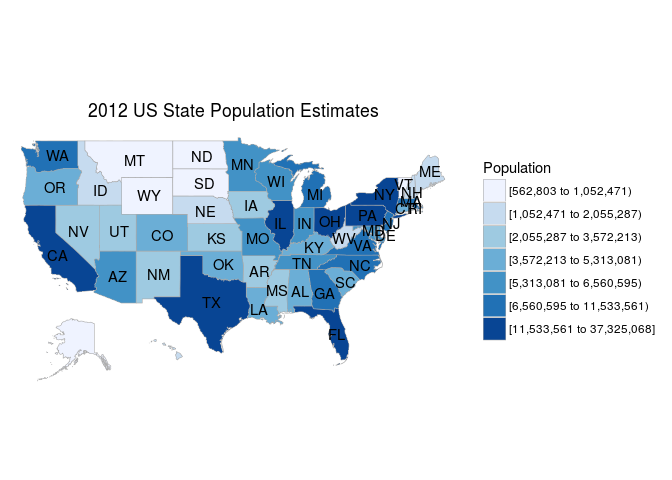
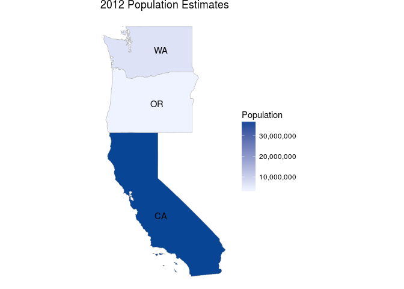

-   [Training & Development](#training-development)
-   [Documentation](#documentation)
-   [Installation](#installation)

choroplethr simplifies the creation of choropleth maps in R. Choropleths are thematic maps where geographic regions, such as states, are colored according to some metric, such as the number of people who live in that state. choroplethr simplifies this process by

1.  Providing ready-made functions for creating choropleths using 220 different maps.
2.  Providing API connections to interesting data sources for making choropleths.
3.  Providing a framework for creating choropleths from arbitrary shapefiles.

Training & Development
----------------------

My free course [Learn to Map Census Data in R](http://www.arilamstein.com/free-course) can teach you how to use this package. There is also a [paid course](http://courses.arilamstein.com/courses/mapmaking-r-choroplethr) that goes into much more detail. I blog about this package's development [here](http://www.arilamstein.com/blog).

Documentation
-------------

Please see the following pages for more details.

1.  [Introduction](http://cran.r-project.org/web/packages/choroplethr/vignettes/a-introduction.html)
2.  [US State Choropleths](http://cran.r-project.org/web/packages/choroplethr/vignettes/b-state-choropleth.html)
3.  [US County Choropleths](http://cran.r-project.org/web/packages/choroplethr/vignettes/c-county-choropleth.html)
4.  [Country Choropleths](http://cran.r-project.org/web/packages/choroplethr/vignettes/d-country-choropleth.html)
5.  [Mapping US Census Data](http://cran.r-project.org/web/packages/choroplethr/vignettes/e-mapping-us-census-data.html)
6.  [Mapping World Bank WDI Data](http://cran.r-project.org/web/packages/choroplethr/vignettes/f-world-bank-data.html)
7.  [Animated Choropleths](http://cran.r-project.org/web/packages/choroplethr/vignettes/g-animated-choropleths.html)
8.  [Creating Your Own Maps](http://cran.r-project.org/web/packages/choroplethr/vignettes/h-creating-your-own-maps.html)
9.  [Creating Administrative Level 1 Maps](http://cran.r-project.org/web/packages/choroplethr/vignettes/i-creating-admin1-maps.html)

Installation
------------

To install the latest stable release type the following from an R console:

``` r
library(choroplethr)
library(choroplethrMaps)
data(df_pop_state)
state_choropleth(df_pop_state, title="2012 US State Population Estimates", legend="Population")
```

<!-- -->

``` r
library(choroplethrMaps)

?state.regions
data(state.regions)
head(state.regions)
```

    ##       region abb fips.numeric fips.character
    ## 1     alaska  AK            2             02
    ## 2    alabama  AL            1             01
    ## 3   arkansas  AR            5             05
    ## 4    arizona  AZ            4             04
    ## 5 california  CA            6             06
    ## 6   colorado  CO            8             08

``` r
state_choropleth(df_pop_state,
                 title      = "2012 Population Estimates",
                 legend     = "Population",
                 num_colors = 1,
                 zoom       = c("california", "washington", "oregon"))
```

<!-- -->
