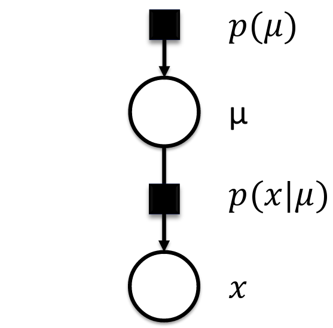

```{r setup, include=FALSE}
knitr::opts_chunk$set(cache=TRUE)
```

# Introduction to Model-Based Machine Learning

## Introduction
During the last few years, the field of machine learning has moved to centre stage in the world of technology. Today thousands of scientists and engineers are applying machine learning to an extraordinarily broad range of domains. However, making effective use of machine learning in practice can be daunting, especially for newcomers to the field. Here are some of the principal challenges encountered when trying to solve real-world problems using machine learning.

In this book we look at machine learning from a fresh perspective which we call model-based machine learning. This viewpoint helps to address all of these challenges, and makes the process of creating effective machine learning solutions much more systematic. It is applicable to the full spectrum of machine learning techniques and application domains, and will help guide you towards building successful machine learning solutions without requiring that you master the huge literature on machine learning.

## Current Challenges in Adopting Machine Learning
“I am overwhelmed by the choice of machine learning methods and techniques. There’s too much to learn!”

“I don’t know which algorithm to use or why one would be better than another for my problem.”

“My problem doesn’t seem to fit with any standard algorithm.”

## What is Model-Based Machine Learning (MBML)
The field of machine learning has experienced the development of thousands of learning algorithms. Typically, scientists choose from these algorithms to solve specific problems. Their choices are constrained by their familiarity with the algorithms. In this classical/traditional framework of machine learning, scientists are constrained to making some assumptions so as to use an existing algorithm. This is in contrast to the model-based machine learning approach which seeks to create a bespoke solution tailored to each new problem. The goal of model-based machine learning is to provide a single development framework which supports the creation of a wide range of bespoke models. This different framework emerged from an important convergence of three key ideas: (i) the adoption of a Bayesian viewpoint, (ii) the use of probabilistic graphical models, and (iii) the application of fast, deterministic, efficient and approximate inference algorithms. The core idea is that all assumptions about the problem domain are made explicit in the form of a model. In this framework, a model is simply a set of assumptionsabout the world expressed in a probabilistic graphical format with all the parameters and variables expressed as random components.

## The Key Ideas of MBML

### Factor Graphs
The second cornerstone to model-based machine learning is the use of Probabilistic Graphical Models (PGM), particularly factor graphs. A PGM is a diagrammatic representation of the joint probability distribution over all random variables in a model expressed as a graph. Factor graphs is a type of PGM that consist of circular nodes representing random variables, square nodes for the conditional probability distributions (factors), and vertices for conditional dependencies between nodes (Figure 2). They provide a general framework for modeling the joint distribution of a set of random variables. The joint probability $P(Q, X)$ over the whole model in Figure 1 is factorized as (Equation 1):  
$$ P(Q, X) = P(Q) * P(X|Q)$$  
Where Q are the set of model parameters and X are the set of observed variables



In factor graphs, we treat the traffic congestion states as random variables and learn their probability distributions using Bayesian inference algorithms along the graph. Inference/learning is simply the product of factors over a subset of variables in the graph. This allows for easy implementation of local message passing algorithms.

### Bayesian Inference
The first key idea enabling this different framework for machine learning is Bayesian inference/learning. In model-based machine learning, latent/hidden parameters are expressed as random variables with probability distributions. This allows for a coherent and principled manner of quantification of uncertainty in the model parameters. Once the observed variables in the model are fixed to their observed values, initially assumed probability distributions(i.e. priors)are updated using the Bayes theorem. This is in contrast to the traditional/classical machine learning framework where model parameters are assigned average values that are determined by optimizing an objective function. Bayesian inference on large models over millions of variables is similarly implemented using the Bayes theorem but in a more complex manner. This is because Bayes theorem is an exact inference technique that is intractable over large datasets. In the past decade,the increase of processing power of computers has enabled research and development of fast and efficient inference algorithms that can scale to large data. In Section V of this paper, we describe two such algorithms based on local message passing along factor graphs.

### Probabilistic Programming
Probabilistic programming is a flexible software development environment for model-based machine learning. It takes existing programming languages and adds support for random variables, constraints on variables and inference packages. In this environment, models can be described in a compact form with a few lines of code, and then an inference engine is called to automatically generate inference routines (and even source code) to solve a wide variety of models. Some notable examples of probabilistic programming languages include Infer.Net [@minka2010], Stan [@stan2016], BUGS [@lunn2000], church [@goodman2008], and PyMC [@patil2010]. In this project, we access Stan algorithms through the R interface [@rstan2016] as described in section 5.

## Stages of MBML

### Describe the Model
Describe the process that generated the data.

### Incorporate Observed Data
Condition the observed variables to their known quantities

### Perform Inference
Perform backward reasoning to update the prior distribution over the latent variables or parameters.

## Case Study

### Traffic Prediction
Suppose you wish to track the changing skill of a player in an online gaming service (this is the problem we will explore in detail in Chapter 3). A machine learning textbook might tell you that there is an algorithm called a Kalman filter [Kalman, 1960] which can be used for these kinds of problems. Suppose you decide to try and make use of some Kalman filter software to predict how a player’s skill evolves over time. First you will have to work out how to convert the skill prediction task into the form of a standard Kalman filter. Having done that, if you are lucky, the software might give a sufficiently good solution. However, the results from using an off-the-shelf algorithm often fail to reach the accuracy level required by real applications. How will you modify the algorithm, and the corresponding software, to achieve better results? It seems you will have to become an expert on the Kalman filter algorithm, and to delve into the software implementation, in order to make progress.

Contrast this with the model-based approach. You begin by listing the assumptions which your solution must satisfy. This defines your model. You then use this model to create the corresponding machine-learning algorithm, which is a mechanical process that can be automated. If your assumptions happen to correspond to those which are implicit in the Kalman filter, then your algorithm will correspond precisely to the Kalman filtering algorithm (and this will happen even if you have never heard of a Kalman filter). Perhaps, however, the model for your particular application has somewhat different assumptions. In this case you will obtain a variant of the Kalman filter, appropriate to your application. Whether this variant already exists, or whether it is a novel algorithm, is irrelevant if your goal is to find the best solution to your problem. Suppose you try your model-based algorithm, and the results again fall short of your requirements. Now you have a framework for improving the results by examining and modifying the assumptions to produce a better model, along with the corresponding improved algorithm. As a domain expert it is far easier and more intuitive to understand and change the assumptions than it is to modify a machine learning algorithm directly. Even if your goal is simply to understand the Kalman filter, then starting with the model assumptions is by far the clearest and simplest way to derive the filtering algorithm, and to understand what Kalman filters are all about.


## Conclusion
the proposed machine learning approach provides a systematic process of developing bespoke models tailored to our specific problem. It also provides transparency in our model because we explicitly defined our modelassumptions by leveraging prior knowledge about human travel. Our approach also allows handling of uncertainty in a principled manner using probability theory. It also does not suffer from overfitting because the model parameters are learned using Bayesian inference and not optimization. Finally, our approach separates the model development from inference which allows us to build several models and use the same inference algorithm to learn the model parameters. This in turn helps to quickly compare several alternative modelsand select the best model that is explained by the observed data. 

## References
For further reading, refer to the following references.  

1. J. Winn, C. Bishop, and T. Diethe, Model-Based Machine Learning,Microsoft Research, [http://www.mbmlbook.com/](http://www.mbmlbook.com/),2015.

2. C. M. Bishop, “Model-based machine learning” Phil Trans R Soc, A 371: 20120222. [http://dx.doi.org/10.1098/rsta.2012.0222](http://dx.doi.org/10.1098/rsta.2012.0222), Jan. 2013

3. T. Minka, J. Winn, J. Guiver, and D. Knowles, Infer.NET, Microsoft Research Cambridge, [http://research.microsoft.com/infernet](http://research.microsoft.com/infernet).2010.

4. Stan Development Team, “Stan Modeling Language Users Guide and Reference Manual,” Version 2.9.0,[http://mc-stan.org](http://mc-stan.org),2016.

5. J. Lunn, A.Thomas, N. Best, and D. Spiegelhalter, “[WinBUGS --a Bayesian modelling framework: concepts, structure, and extensibility,]()”, Statistics and Computing,10:325—337, 2000.

6. N. D. Goodman, V. K. Mansinghka, D. M. Roy, K. Bonawitz, and J. B.Tenenbaum,“[Church: a language for generative models]()", In Uncertainty in Artificial Intelligence (UAI), pages 220–229, 2008.

7. Patil, A., D. Huard and C.J. Fonnesbeck. 2010. [PyMC: Bayesian Stochastic Modelling in Python. Journal of Statistical Software](), 35(4), pp. 1-81, 2010.

8. Stan Development Team, "[RStan: the R interface to Stan,” Version 2.9.0](http://mc-sta n.org,2016)".

9. D. Emaasit, A. Paz, and J. Salzwedel (2016). ["A Model-Based Machine Learning Approach for Capturing Activity-Based Mobility Patterns using Cellular Data"](). IEEE ITSC 2016. Under Review.

10. D. Emaasit (2017). ["A Model-Based Machine Learning Approach for Predicting Traffic Congestion: A Case Study of Nairobi, Kenya"](). TRB 2017. Under Review.


