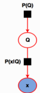

-   [Model-Based Machine Learning and Probabilistic Programming Using RStan](#model-based-machine-learning-and-probabilistic-programming-using-rstan)
    -   [Introduction](#introduction)
    -   [Current Challenges in Adopting Machine Learning](#current-challenges-in-adopting-machine-learning)
    -   [What is Model-Based Machine Learning (MBML)](#what-is-model-based-machine-learning-mbml)
    -   [The Key Ideas of MBML](#the-key-ideas-of-mbml)
        -   [Factor Graphs](#factor-graphs)
        -   [Bayesian Inference](#bayesian-inference)
        -   [Probabilistic Programming](#probabilistic-programming)
    -   [Stages of MBML](#stages-of-mbml)
        -   [Describe the Model](#describe-the-model)
        -   [Incorporate Observed Data](#incorporate-observed-data)
        -   [Perform Inference](#perform-inference)
    -   [Case Studies](#case-studies)
        -   [Traffic Prediction](#traffic-prediction)
        -   [Credit Scoring](#credit-scoring)
        -   [Recommender Systems](#recommender-systems)
    -   [Conclusion](#conclusion)
    -   [References](#references)

Model-Based Machine Learning and Probabilistic Programming Using RStan
======================================================================

Introduction
------------

During the last few years, the field of machine learning has moved to centre stage in the world of technology. Today thousands of scientists and engineers are applying machine learning to an extraordinarily broad range of domains. However, making effective use of machine learning in practice can be daunting, especially for newcomers to the field. Here are some of the principal challenges encountered when trying to solve real-world problems using machine learning

Current Challenges in Adopting Machine Learning
-----------------------------------------------

What is Model-Based Machine Learning (MBML)
-------------------------------------------

The field of machine learning has experienced the development of thousands of learning algorithms. Typically, scientists choose from these algorithms to solve specific problems. Their choices are constrained by their familiarity with the algorithms. In this classical/traditional framework of machine learning, scientists are constrained to making some assumptions so as to use an existing algorithm. This is in contrast to the model-based machine learning approach which seeks to create a bespoke solution tailored to each new problem. The goal of model-based machine learning is to provide a single development framework which supports the creation of a wide range of bespoke models. This different framework emerged from an important convergence of three key ideas: (i) the adoption of a Bayesian viewpoint, (ii) the use of probabilistic graphical models, and (iii) the application of fast, deterministic, efficient and approximate inference algorithms. The core idea is that all assumptions about the problem domain are made explicit in the form of a model. In this framework, a model is simply a set of assumptionsabout the world expressed in a probabilistic graphical format with all the parameters and variables expressed as random components.

The Key Ideas of MBML
---------------------

### Factor Graphs

The second cornerstone to model-based machine learning is the use of Probabilistic Graphical Models (PGM), particularly factor graphs. A PGM is a diagrammatic representation of the joint probability distribution over all random variables in a model expressed as a graph. Factor graphs is a type of PGM that consist of circular nodes representing random variables, square nodes for the conditional probability distributions (factors), and vertices for conditional dependencies between nodes (Figure 2). They provide a general framework for modeling the joint distribution of a set of random variables. The joint probability *P*(*Q*, *X*) over the whole model in Figure 1 is factorized as (Equation 1):
*P*(*Q*, *X*)=*P*(*Q*)\**P*(*X*|*Q*)
Where Q are the set of model parameters and X are the set of observed variables

In factor graphs, we treat the traffic congestion states as random variables and learn their probability distributions using Bayesian inference algorithms along the graph. Inference/learning is simply the product of factors over a subset of variables in the graph. This allows for easy implementation of local message passing algorithms.

### Bayesian Inference

The first key idea enabling this different framework for machine learning is Bayesian inference/learning. In model-based machine learning, latent/hidden parameters are expressed as random variables with probability distributions. This allows for a coherent and principled manner of quantification of uncertainty in the model parameters. Once the observed variables in the model are fixed to their observed values, initially assumed probability distributions(i.e. priors)are updated using the Bayes theorem. This is in contrast to the traditional/classical machine learning framework where model parameters are assigned average values that are determined by optimizing an objective function. Bayesian inference on large models over millions of variables is similarly implemented using the Bayes theorem but in a more complex manner. This is because Bayes theorem is an exact inference technique that is intractable over large datasets. In the past decade,the increase of processing power of computers has enabled research and development of fast and efficient inference algorithms that can scale to large data. In Section V of this paper, we describe two such algorithms based on local message passing along factor graphs.

### Probabilistic Programming

Probabilistic programming is a flexible software development environment for model-based machine learning. It takes existing programming languages and adds support for random variables, constraints on variables and inference packages. In this environment, models can be described in a compact form with a few lines of code, and then an inference engine is called to automatically generate inference routines (and even source code) to solve a wide variety of models. Some notable examples of probabilistic programming languages include Infer.Net \[@minka2010\], Stan \[@stan2016\], BUGS \[@lunn2000\], church \[@goodman2008\], and PyMC \[@patil2010\]. In this project, we access Stan algorithms through the R interface \[@rstan2016\] as described in section 5.

Stages of MBML
--------------

### Describe the Model

### Incorporate Observed Data

### Perform Inference

Case Studies
------------

### Traffic Prediction

### Credit Scoring

### Recommender Systems

Conclusion
----------

In the next blog post, we shall see how to perform geostatistical analysis on spatial data.

References
----------

For further reading, refer to the following references.

\section*{References}\label{references}\addcontentsline{toc}{section}{References}
 1{\]} Bishop, C. 2012. . John Wiley & Sons, Inc.

2{\]} Goodman, D. et al. 2010. Church - a language for generative models. . 11, 4 (Mar. 2010), 261--263.

3{\]} Lunn, J. et al. 2000. WinBUGS a Bayesian modelling framework, concepts, structure, and extensibility. . 11, 4 (Mar. 2000), 261--263.

4{\]} Minka, T. et al. 2010. Infer.NET. . 11, 4 (Mar. 2010), 261--263.

5{\]} Patil, A. 2010. PyMC - Bayesian Stochastic Modelling in Python. . 11, 4 (Mar. 2010), 1--81.

6{\]} Stan Development Team, J. 2016. RStan - the R interface to Stan Version 2.9.0. . 11, 4 (Mar. 2016), 261--263.

7{\]} Stan Development Team, R. 2010. . John Wiley & Sons, Inc.

8{\]} Winn, J. et al. 2015. Model-Based Machine Learning. . 11, 4 (Mar. 2015), 261--263.
