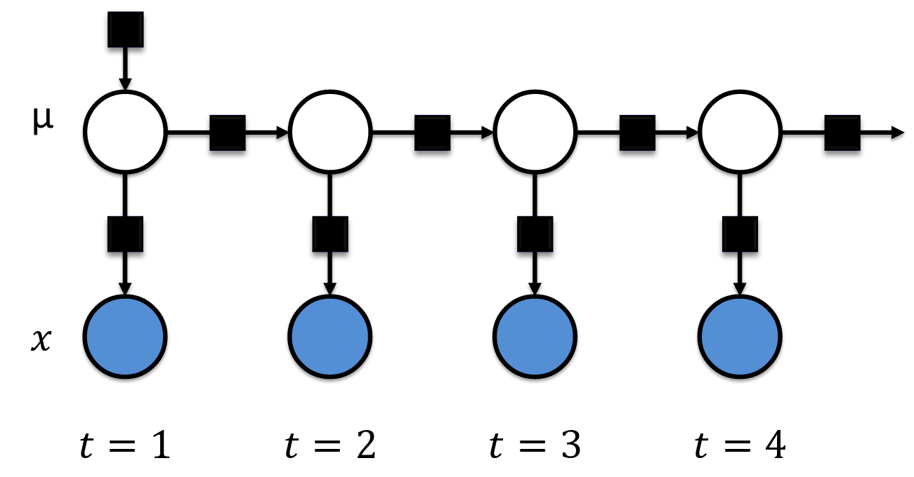

-   [Introduction to Model-Based Machine Learning](#introduction-to-model-based-machine-learning)
    -   [Introduction](#introduction)
    -   [Challenges in Adopting Machine Learning](#challenges-in-adopting-machine-learning)
    -   [The Defining moment](#the-defining-moment)
    -   [What is Model-Based Machine Learning (MBML)](#what-is-model-based-machine-learning-mbml)
    -   [The Key Ideas of MBML](#the-key-ideas-of-mbml)
        -   [Bayesian Inference](#bayesian-inference)
        -   [Factor Graphs](#factor-graphs)
        -   [Probabilistic Programming](#probabilistic-programming)
    -   [Stages of MBML](#stages-of-mbml)
    -   [Case Study](#case-study)
        -   [A Simple Model for Traffic Prediction](#a-simple-model-for-traffic-prediction)
        -   [Learning the Model Parameters using a Probabilisitic Programming Language](#learning-the-model-parameters-using-a-probabilisitic-programming-language)
        -   [Evaluating Model Results](#evaluating-model-results)
    -   [Conclusion](#conclusion)
    -   [References](#references)

Introduction to Model-Based Machine Learning
============================================

Introduction
------------

This blog post follows my journey from traditional statistical modeling to Machine Learning (ML) and introduces a new paradigm of ML called **Model-Based Machine Learning** (Bishop, 2013). It will particulary be interesting to new comers or other people who want to make a shift to machine learning for their research or practice.

During my Masters in Transportation Engineering (2011-2013), I used traditional statistical modeling in my research to study transportation related problems like [highway crashes](http://dx.doi.org/10.1080/19439962.2013.812168). When I started my PhD, I wanted to make a shift to using machine learning because of the powerful use cases I was constantly reading about in several fields in academia and industry. Particulary I wanted to develop methods that learn how people travel within cities so that we can better plan our transportation infrastructure.

Challenges in Adopting Machine Learning
---------------------------------------

I, however, found this shift from traditional statistical modeling to machine learning to be daunting because:

1.  There was a vast amount of literature to read, about the 1000s of existing ML algorithms. There was too much learn including the new vocabulary like "features", "feature engineering", etc.

2.  I had to understand which algorithms to use or why one would be better than another for my urban mobility research projects.

3.  What if my problem didn't seem to fit with any standard algorithm? Would I have to devise a new algorithm.

The Defining moment
-------------------

As, I continued to read this vast amount of literature and watch several MOOCs on machine learning, I discovered Prof. Daphne Koller's [course on Probabilistic Graphical Models (PGMs) on Coursera](https://www.coursera.org/learn/probabilistic-graphical-models). This later led me to a text book by Prof. Christopher Bishop titled ["Pattern Recognition and Machine Learning"](http://www.amazon.com/Pattern-Recognition-Learning-Information-Statistics/dp/0387310738/ref=sr_1_2?ie=UTF8&s=books&qid=1263391804&sr=8-2#reader_0387310738) which I found easy to understand. So naturally I looked up Bishop's other publications and that's when I found his paper titled ["Model-Based Machine Learning"](http://rsta.royalsocietypublishing.org/content/371/1984/20120222). This was a career defining moment for me because I feel in love with Bayesian Machine Learning. I later discovered that Bishop and his colleagues at Microsoft Research - Cambridge were writing a [book](http://www.mbmlbook.com/) (Winn et al., 2015) on the same topic.

What is Model-Based Machine Learning (MBML)
-------------------------------------------

The field of machine learning has experienced the development of thousands of learning algorithms. Typically, scientists choose from these algorithms to solve specific problems. Their choices are constrained by their familiarity with the algorithms. In this classical/traditional framework of machine learning, scientists are constrained to making some assumptions so as to use an existing algorithm. This is in contrast to the model-based machine learning approach which seeks to create a bespoke solution tailored to each new problem.

The goal of MBML is to provide a single development framework which supports the creation of a wide range of bespoke models. This different framework emerged from an important convergence of three key ideas:

1.  the adoption of a Bayesian viewpoint,

2.  the use of factor graphs (a type of probabilistic graphical model), and

3.  the application of fast, deterministic, efficient and approximate inference algorithms.

The core idea is that all assumptions about the problem domain are made explicit in the form of a model. In this framework, a model is simply a set of assumptions about the world expressed in a probabilistic graphical format with all the parameters and variables expressed as random components.

The Key Ideas of MBML
---------------------

### Bayesian Inference

The first key idea enabling this different framework for machine learning is Bayesian inference/learning. In MBML, latent/hidden parameters are expressed as random variables with probability distributions. This allows for a coherent and principled manner of quantification of uncertainty in the model parameters. Once the observed variables in the model are fixed to their observed values, initially assumed probability distributions(i.e. priors)are updated using the Bayes theorem.

This is in contrast to the traditional/classical machine learning framework where model parameters are assigned average values that are determined by optimizing an objective function. Bayesian inference on large models over millions of variables is similarly implemented using the Bayes theorem but in a more complex manner. This is because Bayes theorem is an exact inference technique that is intractable over large datasets. In the past decade,the increase of processing power of computers has enabled research and development of fast and efficient inference algorithms that can scale to large data like Belief Propagation (BP), Expectation Propagation (EP), Variational Bayes (VB).

### Factor Graphs

The second cornerstone to MBML is the use of Probabilistic Graphical Models (PGM), particularly factor graphs. A PGM is a diagrammatic representation of the joint probability distribution over all random variables in a model expressed as a graph. Factor graphs is a type of PGM that consist of circular nodes representing random variables, square nodes for the conditional probability distributions (factors), and vertices for conditional dependencies between nodes (Figure 2). They provide a general framework for modeling the joint distribution of a set of random variables.

The joint probability *P*(*μ*, *X*) over the whole model in Figure 1 is factorized as:

*P*(*μ*, *X*)=*P*(*μ*)\**P*(*X*|*μ*)

Where is the model parameter and X are the set of observed variables


In factor graphs, we treat the latent parameters as random variables and learn their probability distributions using Bayesian inference algorithms along the graph. Inference/learning is simply the product of factors over a subset of variables in the graph. This allows for easy implementation of local message passing algorithms.

### Probabilistic Programming

Probabilistic programming is a flexible software development environment for model-based machine learning. It takes existing programming languages and adds support for random variables, constraints on variables and inference packages. In this environment, models can be described in a compact form with a few lines of code, and then an inference engine is called to automatically generate inference routines (and even source code) to solve a wide variety of models. Some notable examples of probabilistic programming languages include Infer.Net, Stan, BUGS, church, and PyMC. In this blog post, we shall access Stan algorithms through the R interface.

Stages of MBML
--------------

There are 3 steps to model based machine learning namely:

1.  **Describe the Model**: Describe the process that generated the data using factor graphs.

2.  **Condition on Observed Data**: Condition the observed variables to their known quantities

3.  **Perform Inference**: Perform backward reasoning to update the prior distribution over the latent variables or parameters. In other words, calculate the posterior probability distributions of latent variables conditioned on observed variables.

Case Study
----------

### A Simple Model for Traffic Prediction

We apply the model-based approach by following the three stages of MBML:

1.  **Step 1**: Build a model of our traffic congestion problem. We begin by listing the assumptions which our problem must satisfy. We assume that there's a latent traffic congestion state (*μ*) that we are interested in learning which has a Gausian distribution with some mean and standard deviation. This traffic congestion state will determine the observed speed measurement at the sensors (X). We then introduce a condition probability *P*(*X*|*μ*) which the probability of X conditioned that we have observed *μ*. We also know that traffic at some subsequent time period will depend on the previous traffic state. So we introduce another factor graph at the next time step. We assume that it's latent variable has a Gaussian distribution centered at the quantity of the previous state with some (known or unknown) standard deviation i.e. *P*(*μ*<sub>2</sub>|*μ*<sub>1</sub>).



1.  **Step 2**: Incorporate observed data. We condition the observed variable to their know quantities. This is represented by shading the node in blue, as shown in the previous figure.

2.  **Step 3**: Perform Bayesian Inference. By using a probabilsitic programming language, we are able to write a compact piece of code that performs inference by simply calling a built-in inference algorithm.

The bespoke model we've built together with the inference algorithm constitute our custom machine learning algorithm specific to our traffic prediction problem. If you are familiar with the literature, you might find out that we have just developed a common algorithm called the Kalman filter. We can extend our model by adding other assumptions to account for weather, pavement, transportation network conditions and sports events. These assumptions may obtain a variant of the Kalman filter, appropriate to our application. Whether this variant already exists, or whether it is a novel algorithm, is irrelevant if your goal is to find the best solution to your problem.

If we implemented our model-based algorithm and obtained less accurate results, we can easily examine and modify our model assumptions to produce a better model. In their experience, Winn et al. (2015) find it "*far easier and more intuitive to understand and change the assumptions than it is to modify a machine learning algorithm directly. Even if your goal is simply to understand the Kalman filter, then starting with the model assumptions is by far the clearest and simplest way to derive the filtering algorithm, and to understand what Kalman filters are all about*".

### Learning the Model Parameters using a Probabilisitic Programming Language

For this case study, we shall use Stan to learn the model parameters. Stan provides an R interface, RStan, which can be used to call Stan algorithms from within the [R programming lanuage](http://www.r-project.org/) Firstly, follow this [link to get the prerequisites for installing RStan](https://github.com/stan-dev/rstan/wiki/RStan-Getting-Started#prerequisites).

Then install the latest rstan package and the packages it depends on like this:

``` r
## omit the 's' in 'https' if you cannot handle https downloads
install.packages('rstan', repos = 'https://cloud.r-project.org/', dependencies = TRUE)

## If all else fails, you can try to install rstan from source via
install.packages("rstan", type = "source")
```

You are recommended to restart R after the installation before loading the rstan package. Then load the rstan library like this:

``` r
library(rstan)
```

Now we can describe our model for traffic congestion in a compact language using the Stan modeling language as follows:

\*. The first section of the below code specifies the data that is conditioned upon by Bayes Rule

\*. The second section of the code defines the parameters whose posterior distribution is sought using Bayes Rule

``` r
traffic_model <- "
  data {
  int<lower=0> N;          //  the number of speed measurements, N; constrained to be non-negative
  real y[N];               // vector of observed speed measurements,y1, . . . , yN (real = double)
  real<lower=0> sigma[N]; //  the standard errors, σ1, . . . σN, of speed measurements
}
parameters {
  real mu;            // the mean of the traffic speeds
  real<lower=0> tau; // the standard deviation of the traffic speeds
  real theta[N];     // the unstandardized speed measurement
}
model {
  theta ~ normal(mu, tau);
  y ~ normal(theta, sigma); // sigma is the standard deviation
}
"
```

It is recommended that we specify the above model in a separate text file with extension *.stan*. However for this tutorial we shall combine it in the same R Markdown file.

After describing the model, you can perform inference by calling Stan inference engine as shown in the code chunk below. Calling the `stan()` function performs three fundamental operations:

1.  First, your Stan program is translated to C++ code using the `stanc()` function,

2.  Then the resulting C++ code is compiled to create a DSO (also called a dynamic link library (DLL)) that can be loaded by R,

3.  Finally, the DSO is run to sample from the posterior distribution.

``` r
traffic <- read.table("data/traffic.txt", header = TRUE) 

traffic_data <- list(y = traffic[, "sensor_speed"], 
                     sigma = traffic[, "sigma"], 
                     N = nrow(traffic))

traffic_model_fit <- stan(model_code = traffic_model, model_name = "traffic-prediction", 
                          data = traffic_data, iter = 1000, chains = 4, save_dso = TRUE)
```

### Evaluating Model Results

Now, we can use the `print()` function to check out the results in `traffic_model_fit` including a summary of the parameter of the model as well as the log-posterior .

``` r
print(traffic_model_fit, digits = 1)
```

Conclusion
----------

There are several potential advantages of using model-based machine learning including;

-   This approach provides a systematic process of developing bespoke models tailored to our specific problem.

-   It also provides transparency in our model because we explicitly defined our modelassumptions by leveraging prior knowledge about human travel.

-   This approach allows handling of uncertainty in a principled manner using probability theory.
-   It also does not suffer from overfitting because the model parameters are learned using Bayesian inference and not optimization.

-   Finally, this approach separates the model development from inference which allows us to build several models and use the same inference algorithm to learn the model parameters. This in turn helps to quickly compare several alternative modelsand select the best model that is explained by the observed data.

References
----------

For further reading, refer to the following references.

1.  J. Winn, C. Bishop, and T. Diethe, Model-Based Machine Learning,Microsoft Research, <http://www.mbmlbook.com/>,2015.

2.  C. M. Bishop, “Model-based machine learning” Phil Trans R Soc, A 371: 20120222. <http://dx.doi.org/10.1098/rsta.2012.0222>, Jan. 2013

3.  T. Minka, J. Winn, J. Guiver, and D. Knowles, Infer.NET, Microsoft Research Cambridge, <http://research.microsoft.com/infernet>.2010.

4.  Stan Development Team, “Stan Modeling Language Users Guide and Reference Manual,” Version 2.9.0,<http://mc-stan.org>,2016.

5.  J. Lunn, A.Thomas, N. Best, and D. Spiegelhalter, “[WinBUGS --a Bayesian modelling framework: concepts, structure, and extensibility,]()”, Statistics and Computing,10:325—337, 2000.

6.  N. D. Goodman, V. K. Mansinghka, D. M. Roy, K. Bonawitz, and J. B.Tenenbaum,“[Church: a language for generative models]()", In Uncertainty in Artificial Intelligence (UAI), pages 220–229, 2008.

7.  Patil, A., D. Huard and C.J. Fonnesbeck. 2010. [PyMC: Bayesian Stochastic Modelling in Python. Journal of Statistical Software](), 35(4), pp. 1-81, 2010.

8.  Stan Development Team, "[RStan: the R interface to Stan,” Version 2.9.0](http://mc-sta%20n.org,2016)".

9.  D. Emaasit, A. Paz, and J. Salzwedel (2016). ["A Model-Based Machine Learning Approach for Capturing Activity-Based Mobility Patterns using Cellular Data"](). IEEE ITSC 2016. Under Review.
