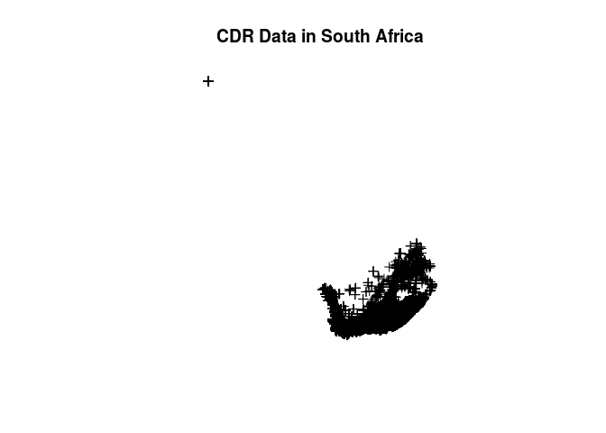
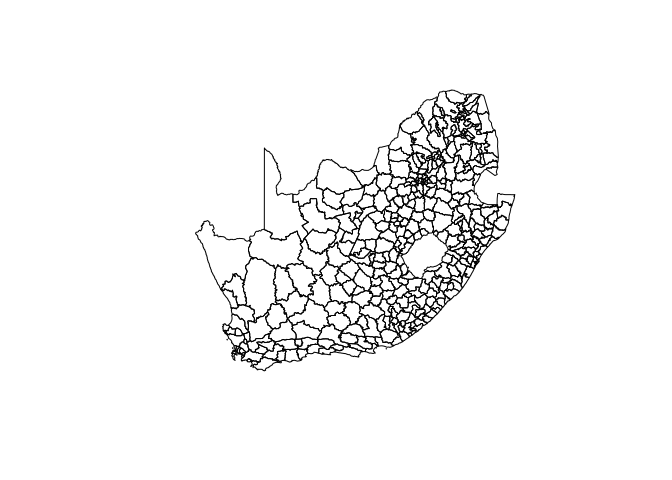
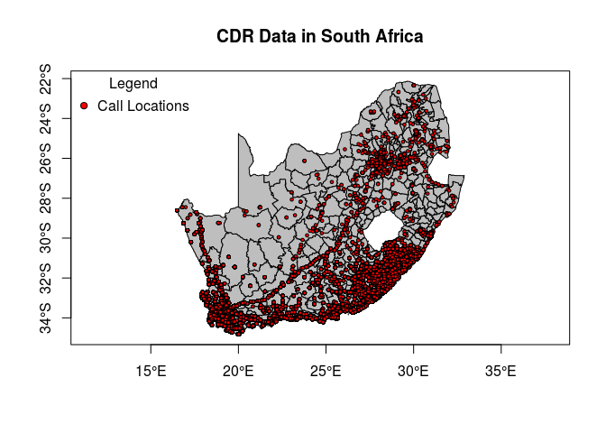
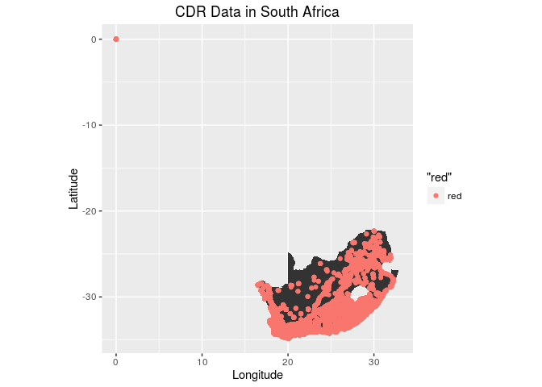
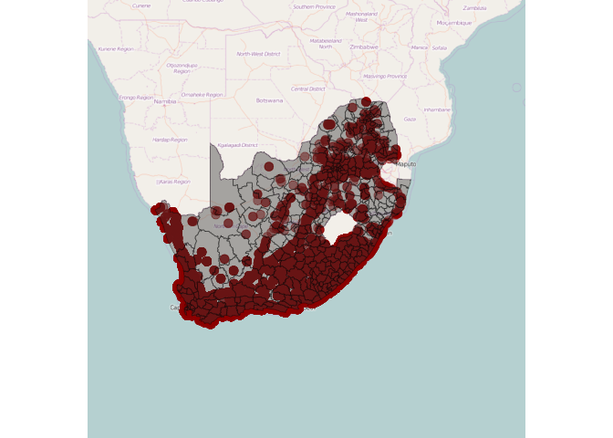

-   [Applied Spatial Data Science with R](#applied-spatial-data-science-with-r)
    -   [Introduction](#introduction)
        -   [Why use R for Spatial Data Analysis](#why-use-r-for-spatial-data-analysis)
            -   [R Packages for Spatial Data Analysis](#r-packages-for-spatial-data-analysis)
    -   [Data Preparation](#data-preparation)
        -   [The Data](#the-data)
        -   [Reading Spatial Data](#reading-spatial-data)
        -   [Spatial Points Dataframe](#spatial-points-dataframe)
    -   [Data Exploration](#data-exploration)
    -   [Data Visualisation](#data-visualisation)
        -   [Visualizing the Data Using Traditional Plot System](#visualizing-the-data-using-traditional-plot-system)
        -   [Visualizing the Data Using spplot Using Lattice package](#visualizing-the-data-using-spplot-using-lattice-package)
        -   [Visializing the Data Using External Libraries](#visializing-the-data-using-external-libraries)
            -   [ggplot2](#ggplot2)
            -   [ggmap](#ggmap)
            -   [Leaflet](#leaflet)
            -   [tmap](#tmap)
    -   [Geostatistical Analysis](#geostatistical-analysis)

Applied Spatial Data Science with R
===================================

Introduction
------------

I recently started working on my Ph.D dissertation which utilizes a vast amount of different spatial data types. During the process, I discovered that there were alot of concepts about using R for spatial data analysis that I was not aware of. The purpose of this report is to document some of those concepts and my favorite packages for spatial data analysis. This includes spatial data preparation, exploration, visualization and geostatistical analysis.

### Why use R for Spatial Data Analysis

You might be asking yourself; why use R for spatial analysis when there are commercial and open source Geographical Information Systems (GIS) like ESRI ArcMap, QGIS, etc?. These are some of my reasons: \* R is free and open source \* Reproducibility: I can repeat my analysis another day \* Packages: There are a vast amount of R packages for statistical modeling, visualisation like **ggplot2**, **leaflet**. etc.

#### R Packages for Spatial Data Analysis

Some of my favorite packages for spatial data analysis include: \* [sp](https://cran.r-project.org/web/packages/sp/index.html): This package provides classes and methods for spatial data; utility functions for plotting maps, working with coordinates, etc. \* [rgdal](https://cran.r-project.org/web/packages/rgdal/index.html): This package provides methods for working with importing and exporting different raster and vector geospatial data formats; Coordinate Reference Systems; projections, etc. \* [rgeos](https://cran.r-project.org/web/packages/rgeos/index.html): \* [ggplot2](http://ggplot2.org/): The most popular package for data visualisation by [Hadely Wickham](http://had.co.nz/) \* [ggmap](https://cran.r-project.org/web/packages/ggmap/index.html): Provides functions to visualize spatial data ontop of static maps from sources like Google Maps, Open Steet Maps, cloudmade and stamen. \* [leaflet](http://rstudio.github.io/leaflet/): Leaflet for R provides functions to control and integrate Leaflet, a JavaScript library for interactive maps, within R. \* [lubridate](https://cran.r-project.org/web/packages/lubridate/index.html): Most of my spatial data have Date-Time measurements. This package provides functions for manipulating dates and times.

Data Preparation
----------------

### The Data

In this tutorial we shall use crime data from the [Houston Police Department](http://www.houstontx.gov/police/cs/stats2.htm) collected over the period of January 2010 - August 2010. This full data is available in the **ggmap** package as the data set "crime".

So let's install **ggmap** and some other packages that we shall need in this tutorial.

``` r
## These are the packages needed for data preparation
suppressPackageStartupMessages(library(ggmap))
suppressPackageStartupMessages(library(sp))
suppressPackageStartupMessages(library(rgdal))
suppressPackageStartupMessages(library(rgeos))
suppressPackageStartupMessages(library(ggplot2))
suppressPackageStartupMessages(library(leaflet))
suppressPackageStartupMessages(library(dplyr))
suppressPackageStartupMessages(library(magrittr))
suppressPackageStartupMessages(library(readr))
suppressPackageStartupMessages(library(lubridate))
```

Let's look at the structure of this data set.

``` r
data(crime)
```

### Reading Spatial Data

The raw data is in text format and 12.6 MB in size.

    ##      date_time       hashed_id  latitude longitude
    ## 1 2.015123e+16 660570183834033 -33.91114  18.61418
    ## 2 2.015123e+16 660574684112000 -34.00284  18.54191
    ## 3 2.015123e+16 660573944817324 -33.98153  18.49034
    ## 4 2.015123e+16 660578844436614 -33.82674  18.53819
    ## 5 2.015123e+16 660579543978203 -33.88652  18.50051
    ## 6 2.015123e+16 660570589985809 -33.45624  22.37440

    ##    date_time                   hashed_id         latitude     
    ##  Min.   :2.015e+16   660577853889743:   152   Min.   :-34.83  
    ##  1st Qu.:2.015e+16   660573844463583:   128   1st Qu.:-34.02  
    ##  Median :2.015e+16   660574513913068:   128   Median :-33.92  
    ##  Mean   :2.015e+16   660577853867870:   113   Mean   :-33.37  
    ##  3rd Qu.:2.015e+16   660574646127052:    83   3rd Qu.:-33.41  
    ##  Max.   :2.015e+16   660577184566109:    79   Max.   :  0.00  
    ##                      (Other)        :217452                   
    ##    longitude    
    ##  Min.   : 0.00  
    ##  1st Qu.:18.56  
    ##  Median :19.02  
    ##  Mean   :21.52  
    ##  3rd Qu.:25.02  
    ##  Max.   :32.29  
    ## 

    ## 'data.frame':    218135 obs. of  4 variables:
    ##  $ date_time: num  2.02e+16 2.02e+16 2.02e+16 2.02e+16 2.02e+16 ...
    ##  $ hashed_id: Factor w/ 93010 levels "660570183815963",..: 16 39325 27003 79771 89002 1925 53311 45258 73256 61511 ...
    ##  $ latitude : num  -33.9 -34 -34 -33.8 -33.9 ...
    ##  $ longitude: num  18.6 18.5 18.5 18.5 18.5 ...

The dataset is made up of 218,136 observations with four columns including date-time, a hased ID, longitude and latitude.

``` r
## Find out how many rows have latitude and longitude equal to zero respectively
(filter(cdr_df, latitude == 0)) %>% count()
```

    ## Source: local data frame [1 x 1]
    ## 
    ##       n
    ##   (int)
    ## 1   499

``` r
(filter(cdr_df, longitude == 0)) %>% count()
```

    ## Source: local data frame [1 x 1]
    ## 
    ##       n
    ##   (int)
    ## 1   499

``` r
cdr_df2 <- filter(cdr_df, latitude != 0 & longitude != 0)
summary(cdr_df2)
```

    ##    date_time                   hashed_id         latitude     
    ##  Min.   :2.015e+16   660577853889743:   152   Min.   :-34.83  
    ##  1st Qu.:2.015e+16   660573844463583:   128   1st Qu.:-34.02  
    ##  Median :2.015e+16   660574513913068:   128   Median :-33.92  
    ##  Mean   :2.015e+16   660577853867870:   113   Mean   :-33.45  
    ##  3rd Qu.:2.015e+16   660574646127052:    83   3rd Qu.:-33.42  
    ##  Max.   :2.015e+16   660577184566109:    79   Max.   :-22.34  
    ##                      (Other)        :216953                   
    ##    longitude    
    ##  Min.   :16.50  
    ##  1st Qu.:18.56  
    ##  Median :19.03  
    ##  Mean   :21.57  
    ##  3rd Qu.:25.05  
    ##  Max.   :32.29  
    ## 

There are 499 records with latitude and longitude equal to zero. We shall remove these assuming that they are errors in the data. when these coordinate errors are removed, we remain with 217,636 records.

Create new separate columns for the Date and Time. Format the date and time variables into data and time data types respectively. South Africa Time zone is UTC+02:00.

    ## Warning: 34 failed to parse.

    ##      date_time       hashed_id  latitude longitude         date_time2
    ## 1 2.015123e+16 660570183834033 -33.91114  18.61418 20151228061501.184
    ## 2 2.015123e+16 660574684112000 -34.00284  18.54191 20151228061501.184
    ## 3 2.015123e+16 660573944817324 -33.98153  18.49034 20151228062135.784
    ## 4 2.015123e+16 660578844436614 -33.82674  18.53819 20151228062135.784
    ## 5 2.015123e+16 660579543978203 -33.88652  18.50051 20151228062135.784
    ## 6 2.015123e+16 660570589985809 -33.45624  22.37440 20151228061458.272
    ##            date_time3
    ## 1 2015-12-28 06:15:01
    ## 2 2015-12-28 06:15:01
    ## 3 2015-12-28 06:21:35
    ## 4 2015-12-28 06:21:35
    ## 5 2015-12-28 06:21:35
    ## 6 2015-12-28 06:14:58

    ## 'data.frame':    218135 obs. of  6 variables:
    ##  $ date_time : num  2.02e+16 2.02e+16 2.02e+16 2.02e+16 2.02e+16 ...
    ##  $ hashed_id : Factor w/ 93010 levels "660570183815963",..: 16 39325 27003 79771 89002 1925 53311 45258 73256 61511 ...
    ##  $ latitude  : num  -33.9 -34 -34 -33.8 -33.9 ...
    ##  $ longitude : num  18.6 18.5 18.5 18.5 18.5 ...
    ##  $ date_time2: chr  "20151228061501.184" "20151228061501.184" "20151228062135.784" "20151228062135.784" ...
    ##  $ date_time3: POSIXct, format: "2015-12-28 06:15:01" "2015-12-28 06:15:01" ...

Write out the processed data into a csv and RDS file.

### Spatial Points Dataframe

Convert the cdr\_df local dataframe into SpatialPointsDataFrame for spatial analysis.

``` r
## Convert to SpatialPointsDataFrame with longitude and latitude so as to use spatial packages
## The CRS is a Geographic CRS called WGS84
coords <- SpatialPoints(cdr_df3[, c("longitude", "latitude")])
cdr_spatial_df <- SpatialPointsDataFrame(coords, cdr_df3)
proj4string(cdr_spatial_df) <- CRS("+proj=longlat +ellps=WGS84")

# Or using the "coordinates" method
cdr_spatial_df1 <- cdr_df3
coordinates(cdr_spatial_df1) <- c("longitude", "latitude")
proj4string(cdr_spatial_df1) <- CRS("+proj=longlat +ellps=WGS84")

# Explore the SpatialPointsDataFrame
head(cdr_spatial_df@coords, 4)
```

    ##      longitude  latitude
    ## [1,]  18.61418 -33.91114
    ## [2,]  18.54191 -34.00284
    ## [3,]  18.49034 -33.98153
    ## [4,]  18.53819 -33.82674

``` r
head(cdr_spatial_df@bbox)
```

    ##                 min      max
    ## longitude   0.00000 32.28528
    ## latitude  -34.82607  0.00000

``` r
## Create a file of the final processed spatial points data frame that will be used for analysis
saveRDS(cdr_spatial_df, "cdr_spatial_data.rds")

## Also create a shapefile of this data
## writeOGR(cdr_spatial_df, dsn = "shapefiles", layer = "cdr-shapefile", driver = "ESRI Shapefile")
```

Data Exploration
----------------

Data Visualisation
------------------

The purpose of this report is conduct spatial analysis of the CDR sample data.

``` r
## Install packages required for spatial analysis
suppressPackageStartupMessages(library(ggplot2))
suppressPackageStartupMessages(library(dplyr))
suppressPackageStartupMessages(library(tidyr))
suppressPackageStartupMessages(library(lubridate))
suppressPackageStartupMessages(library(readr))
suppressPackageStartupMessages(library(magrittr))
suppressPackageStartupMessages(library(leaflet))
suppressPackageStartupMessages(library(ggmap))
suppressPackageStartupMessages(library(tmap))
suppressPackageStartupMessages(library(maps))
suppressPackageStartupMessages(library(RColorBrewer))
suppressPackageStartupMessages(library(classInt))
```

### Visualizing the Data Using Traditional Plot System

``` r
cdr_spatial_df <- readRDS("cdr_spatial_data.rds")
plot(cdr_spatial_df, add = FALSE)
title("CDR Data in South Africa")
```

<!-- -->

``` r
## Create a SpatialPolygonsDataFrame by reading in shapefile data
## Use plot method to plot it
shapefile_2 <- readOGR(dsn = "ZAF_adm", layer = "ZAF_adm2")
```

    ## OGR data source with driver: ESRI Shapefile 
    ## Source: "ZAF_adm", layer: "ZAF_adm2"
    ## with 354 features
    ## It has 18 fields

``` r
plot(shapefile_2)
```

<!-- -->

``` r
## Combine both plots INCREMENTALLY
plot(shapefile_2, col = "grey", axes = TRUE)
plot(cdr_spatial_df, pch = 21, bg = "red", cex = .5, add = TRUE)
title("CDR Data in South Africa")
legend("topleft", title = "Legend", legend = "Call Locations", pch = 21, 
       pt.bg = "red", bty = "n")
```

<!-- -->

### Visualizing the Data Using spplot Using Lattice package

``` r
## spplot provides plotting of spatial data with attributes
```

### Visializing the Data Using External Libraries

#### ggplot2

``` r
cdr_ggplot_df <- as.data.frame(cdr_spatial_df)
shapefile_df2 <- fortify(shapefile_2)
```

    ## Regions defined for each Polygons

``` r
p <- ggplot() + 
  geom_polygon(data = shapefile_df2, aes(x=long, y=lat, group = group)) + coord_equal() +
  geom_point(data = cdr_ggplot_df, aes(longitude,latitude, color = "red")) +
  labs(title = "CDR Data in South Africa") +
  xlab("Longitude") + 
  ylab("Latitude")

p
```

<!-- -->

#### ggmap

``` r
## Create the background layer for the city of Cape Town, South Africa. Two Steps using ggmap

## Step 1: Use "get_map" command to download the images and format them for plotting
southafricaMap <- get_map(location = "Bloemfontein", source = "osm", zoom = 5)
```

    ## Map from URL : http://maps.googleapis.com/maps/api/staticmap?center=Bloemfontein&zoom=5&size=640x640&scale=2&maptype=terrain&sensor=false

    ## Information from URL : http://maps.googleapis.com/maps/api/geocode/json?address=Bloemfontein&sensor=false

``` r
capetownMap <- get_map(location = "bellville southafrica", source = "osm", zoom = 10)
```

    ## Map from URL : http://maps.googleapis.com/maps/api/staticmap?center=bellville+southafrica&zoom=10&size=640x640&scale=2&maptype=terrain&sensor=false

    ## Information from URL : http://maps.googleapis.com/maps/api/geocode/json?address=bellville%20southafrica&sensor=false

``` r
## Step 2: use "ggmap" command to making the plot
saMap <- ggmap(southafricaMap, extent = "device", legend = "topleft")
ctMap <- ggmap(capetownMap, extent = "device", legend = "topleft")

## Load the cdr data for mapping purposes
cdr_data <- cdr_df3
cdr_data <- subset(cdr_data, longitude > 0 & latitude < 0)

# Restrict the data to capetown only
capetown_cdr <- subset(cdr_data, 
                         18.24325 <= longitude & longitude <= 19.43949 & 
                         -34.48969 <= latitude & latitude <= -33.33964)

## Geocode the entire cdr data using longitute and latitute variables
saMap2 <- saMap + geom_point(
  aes(x = longitude, y = latitude), data = cdr_data, 
  alpha = 0.5, color="darkred", size = 3
)

## Geocode only the cape town cdr data using longitute and latitute variables
ctMap <- ctMap + geom_point(
  aes(x = longitude, y = latitude), data = capetown_cdr, 
  alpha = 0.5, color="darkred", size = 3
)

## Install required packages
suppressPackageStartupMessages(library(sp))
suppressPackageStartupMessages(library(maptools))

# Read shapefile data into R using maptools package
shapefile0 <- readShapeSpatial("ZAF_adm/ZAF_adm0.shp", proj4string = CRS("+proj=longlat +datum=WGS84"))
shapefile1 <- readShapeSpatial("ZAF_adm/ZAF_adm1.shp", proj4string = CRS("+proj=longlat +datum=WGS84"))
shapefile2 <- readShapeSpatial("ZAF_adm/ZAF_adm2.shp", proj4string = CRS("+proj=longlat +datum=WGS84"))

## Convert the shapefiles to a data.frame for use with ggplot2/ggmap
shapefile_df0 <- fortify(shapefile0)
```

    ## Regions defined for each Polygons

``` r
shapefile_df1 <- fortify(shapefile1)
```

    ## Regions defined for each Polygons

``` r
shapefile_df2 <- fortify(shapefile2)
```

    ## Regions defined for each Polygons

``` r
## Plot the shapefiles
saMap3 <- saMap2 + geom_polygon(aes(x = long, y = lat, group = group), data = shapefile_df2, colour = "black", alpha = .4, size = .3)

saMap3
```

<!-- -->

#### Leaflet

Leaflet is one of the most popular open-source JavaScript libraries for interactive maps. It’s used by websites ranging from The New York Times and The Washington Post to GitHub and Flickr, as well as GIS specialists like OpenStreetMap, Mapbox, and CartoDB.

This R package makes it easy to integrate and control Leaflet maps in R.

``` r
suppressPackageStartupMessages(library(magrittr))
suppressPackageStartupMessages(library(leaflet))

m <- leaflet() %>% setView(lng = -71.0589, lat = 42.3601, zoom = 12)
m %>% addTiles() 
```

You can use addWMSTiles() to add WMS (Web Map Service) tiles. The map below shows the Base Reflectivity (a measure of the intensity of precipitation occurring) using the WMS from the Iowa Environmental Mesonet:

``` r
leaflet() %>% addTiles() %>% setView(-93.65, 42.0285, zoom = 4) %>%
  addWMSTiles(
    "http://mesonet.agron.iastate.edu/cgi-bin/wms/nexrad/n0r.cgi",
    layers = "nexrad-n0r-900913",
    options = WMSTileOptions(format = "image/png", transparent = TRUE),
    attribution = "Weather data © 2012 IEM Nexrad"
  )
```

#### tmap

Geostatistical Analysis
-----------------------

Geostatistical data are data that could in principle be measured anywhere, but that typically come as measurements at a limited number of observation locations: think of gold grades in an ore body or particulate matter in air samples
