-   [Applied Spatial Data Science with R](#applied-spatial-data-science-with-r)
    -   [Introduction](#introduction)
        -   [Why use R for Spatial Data Analysis](#why-use-r-for-spatial-data-analysis)
            -   [R Packages for Spatial Data Analysis](#r-packages-for-spatial-data-analysis)
    -   [Data Preparation](#data-preparation)
        -   [The Data](#the-data)
        -   [Reading Spatial Data](#reading-spatial-data)
        -   [Spatial Points Dataframe](#spatial-points-dataframe)
            -   [Cordinate Reference Systems](#cordinate-reference-systems)
    -   [Data Exploration](#data-exploration)
    -   [Data Visualisation](#data-visualisation)
        -   [Visualizing the Data Using Traditional Plot System](#visualizing-the-data-using-traditional-plot-system)
        -   [Visializing the Data Using External Libraries](#visializing-the-data-using-external-libraries)
            -   [ggplot2](#ggplot2)
            -   [ggmap](#ggmap)
            -   [Leaflet](#leaflet)
    -   [Geostatistical Analysis](#geostatistical-analysis)
    -   [References](#references)

Applied Spatial Data Science with R
===================================

Introduction
------------

I recently started working on my Ph.D dissertation which utilizes a vast amount of different spatial data types. During the process, I discovered that there were alot of concepts about using R for spatial data analysis that I was not aware of. The purpose of this report is to document some of those concepts and my favorite packages for spatial data analysis. This includes spatial data preparation, exploration, visualization and geostatistical analysis.

### Why use R for Spatial Data Analysis

You might be asking yourself; why use R for spatial analysis when there are commercial and open source Geographical Information Systems (GIS) like ESRI ArcMap, QGIS, etc?. These are some of my reasons:

-   R is free and open source
-   Reproducibility: I can repeat my analysis another day
-   Packages: There are a vast amount of R packages for statistical modeling, visualisation like **ggplot2**, **leaflet**. etc.

#### R Packages for Spatial Data Analysis

Some of my favorite packages for spatial data analysis include:

-   [sp](https://cran.r-project.org/web/packages/sp/index.html): This package provides classes and methods for spatial data; utility functions for plotting maps, working with coordinates, etc.
-   [rgdal](https://cran.r-project.org/web/packages/rgdal/index.html): This package provides methods for working with importing and exporting different raster and vector geospatial data formats; Coordinate Reference Systems; projections, etc.
-   [rgeos](https://cran.r-project.org/web/packages/rgeos/index.html): Provides functions for handling operations on topologies.
-   [ggplot2](http://ggplot2.org/): The most popular package for data visualisation by [Hadely Wickham](http://had.co.nz/)
-   [ggmap](https://cran.r-project.org/web/packages/ggmap/index.html): Provides functions to visualize spatial data ontop of static maps from sources like Google Maps, Open Steet Maps, cloudmade and stamen.
-   [leaflet](http://rstudio.github.io/leaflet/): Leaflet for R provides functions to control and integrate Leaflet, a JavaScript library for interactive maps, within R.
-   [lubridate](https://cran.r-project.org/web/packages/lubridate/index.html): Most of my spatial data have Date-Time measurements. This package provides functions for manipulating dates and times.

Data Preparation
----------------

### The Data

In this tutorial we shall use crime data from the [Houston Police Department](http://www.houstontx.gov/police/cs/stats2.htm) collected over the period of January 2010 - August 2010 by [David Kahle](https://sites.google.com/site/davidkahle/ggmap), creator of the **ggmap** package.

So let's install some of my favorite packages that we shall need in this tutorial.

``` r
## These are some of my favorite packages for spatial data analysis
suppressPackageStartupMessages(library(ggmap))
suppressPackageStartupMessages(library(sp))
suppressPackageStartupMessages(library(rgdal))
suppressPackageStartupMessages(library(rgeos))
suppressPackageStartupMessages(library(ggplot2))
suppressPackageStartupMessages(library(leaflet))
suppressPackageStartupMessages(library(dplyr))
suppressPackageStartupMessages(library(magrittr))
suppressPackageStartupMessages(library(readr))
suppressPackageStartupMessages(library(lubridate))
suppressPackageStartupMessages(library(RColorBrewer))
suppressPackageStartupMessages(library(classInt))
```

### Reading Spatial Data

The data is in a comma separated value (CSV) format and small in size, only 13MB.

``` r
crime_df <- read_csv("data/crime.csv")

## The variables "offense", "month", "day" should be factors
crime_df$offense <- as.factor(crime_df$offense)
crime_df$month <- as.factor(crime_df$month)
crime_df$day <- as.factor(crime_df$day)

## We need to understand the structure of this dataset
str(crime_df)
```

    ## Classes 'tbl_df', 'tbl' and 'data.frame':    86314 obs. of  17 variables:
    ##  $ time    : POSIXct, format: "2010-01-01 06:00:00" "2010-01-01 06:00:00" ...
    ##  $ date    : chr  "1/1/2010" "1/1/2010" "1/1/2010" "1/1/2010" ...
    ##  $ hour    : int  0 0 0 0 0 0 0 0 0 0 ...
    ##  $ premise : chr  "18A" "13R" "20R" "20R" ...
    ##  $ offense : Factor w/ 7 levels "aggravated assault",..: 4 6 1 1 1 3 3 3 3 3 ...
    ##  $ beat    : chr  "15E30" "13D10" "16E20" "2A30" ...
    ##  $ block   : chr  "9600-9699" "4700-4799" "5000-5099" "1000-1099" ...
    ##  $ street  : chr  "marlive" "telephone" "wickview" "ashland" ...
    ##  $ type    : chr  "ln" "rd" "ln" "st" ...
    ##  $ suffix  : chr  "-" "-" "-" "-" ...
    ##  $ number  : int  1 1 1 1 1 1 1 1 1 1 ...
    ##  $ month   : Factor w/ 8 levels "april","august",..: 4 4 4 4 4 4 4 4 4 4 ...
    ##  $ day     : Factor w/ 7 levels "friday","monday",..: 1 1 1 1 1 1 1 1 1 1 ...
    ##  $ location: chr  "apartment parking lot" "road / street / sidewalk" "residence / house" "residence / house" ...
    ##  $ address : chr  "9650 marlive ln" "4750 telephone rd" "5050 wickview ln" "1050 ashland st" ...
    ##  $ lon     : num  -95.4 -95.3 -95.5 -95.4 -95.4 ...
    ##  $ lat     : num  29.7 29.7 29.6 29.8 29.7 ...

The dataset is a data frame with 86,314 observations and 17 variables.

**Note**: This full data is also available in the **ggmap** package as the data set "crime". You can load it into your R envirionment using the command `data(crime)`.

I always like to take a quick look at some of data records and some summary statistics to get familiar with my data. This can be done using the `head()` and `summary()` commands.

``` r
head(crime_df, n = 5)
```

    ## Source: local data frame [5 x 17]
    ## 
    ##                  time     date  hour premise            offense  beat
    ##                (time)    (chr) (int)   (chr)             (fctr) (chr)
    ## 1 2010-01-01 06:00:00 1/1/2010     0     18A             murder 15E30
    ## 2 2010-01-01 06:00:00 1/1/2010     0     13R            robbery 13D10
    ## 3 2010-01-01 06:00:00 1/1/2010     0     20R aggravated assault 16E20
    ## 4 2010-01-01 06:00:00 1/1/2010     0     20R aggravated assault  2A30
    ## 5 2010-01-01 06:00:00 1/1/2010     0     20A aggravated assault 14D20
    ## Variables not shown: block (chr), street (chr), type (chr), suffix (chr),
    ##   number (int), month (fctr), day (fctr), location (chr), address (chr),
    ##   lon (dbl), lat (dbl)

``` r
summary(crime_df)
```

    ##       time                         date                hour      
    ##  Min.   :2010-01-01 06:00:00   Length:86314       Min.   : 0.00  
    ##  1st Qu.:2010-03-08 01:00:00   Class :character   1st Qu.: 8.00  
    ##  Median :2010-05-06 12:00:00   Mode  :character   Median :14.00  
    ##  Mean   :2010-05-04 18:47:44                      Mean   :13.28  
    ##  3rd Qu.:2010-07-02 20:00:00                      3rd Qu.:19.00  
    ##  Max.   :2010-09-01 04:00:00                      Max.   :23.00  
    ##                                                                  
    ##    premise                        offense          beat          
    ##  Length:86314       aggravated assault: 7177   Length:86314      
    ##  Class :character   auto theft        : 7946   Class :character  
    ##  Mode  :character   burglary          :17802   Mode  :character  
    ##                     murder            :  157                     
    ##                     rape              :  378                     
    ##                     robbery           : 6298                     
    ##                     theft             :46556                     
    ##     block              street              type          
    ##  Length:86314       Length:86314       Length:86314      
    ##  Class :character   Class :character   Class :character  
    ##  Mode  :character   Mode  :character   Mode  :character  
    ##                                                          
    ##                                                          
    ##                                                          
    ##                                                          
    ##     suffix              number          month              day       
    ##  Length:86314       Min.   :1.000   may    :11920   friday   :13414  
    ##  Class :character   1st Qu.:1.000   july   :11290   monday   :12535  
    ##  Mode  :character   Median :1.000   april  :11068   saturday :12525  
    ##                     Mean   :1.012   june   :11052   sunday   :11019  
    ##                     3rd Qu.:1.000   august :10962   thursday :12342  
    ##                     Max.   :9.000   march  :10922   tuesday  :12503  
    ##                                     (Other):19100   wednesday:11976  
    ##    location           address               lon              lat       
    ##  Length:86314       Length:86314       Min.   :-99.51   Min.   :27.51  
    ##  Class :character   Class :character   1st Qu.:-95.51   1st Qu.:29.69  
    ##  Mode  :character   Mode  :character   Median :-95.41   Median :29.74  
    ##                                        Mean   :-95.42   Mean   :29.76  
    ##                                        3rd Qu.:-95.34   3rd Qu.:29.81  
    ##                                        Max.   :-91.95   Max.   :37.34  
    ##                                        NA's   :5        NA's   :5

### Spatial Points Dataframe

In order to leverage the classes and methods in the several spatial packages, including the **sp** package, we need to convert the *"crime\_df"* local dataframe into **"SpatialPointsDataFrame"**.

``` r
## Because the sp pacakge is not able to find an inherited method for function ‘coordinates’ for signature ‘"tbl_df", let's convert our local dataframe.
crime_df <- data.frame(crime_df) %>% filter(lon != "NA")

## Convert to SpatialPointsDataFrame with longitude and latitude so as to use spatial packages
## The CRS is a Geographic CRS called WGS84
coords <- SpatialPoints(crime_df[, c("lon", "lat")])
crime_spatial_df <- SpatialPointsDataFrame(coords, crime_df)
proj4string(crime_spatial_df) <- CRS("+proj=longlat +ellps=WGS84")
```

Let's take a look at the structure of this new data type.

``` r
str(crime_spatial_df)
```

    ## Formal class 'SpatialPointsDataFrame' [package "sp"] with 5 slots
    ##   ..@ data       :'data.frame':  86309 obs. of  17 variables:
    ##   .. ..$ time    : POSIXct[1:86309], format: "2010-01-01 06:00:00" ...
    ##   .. ..$ date    : chr [1:86309] "1/1/2010" "1/1/2010" "1/1/2010" "1/1/2010" ...
    ##   .. ..$ hour    : int [1:86309] 0 0 0 0 0 0 0 0 0 0 ...
    ##   .. ..$ premise : chr [1:86309] "18A" "13R" "20R" "20R" ...
    ##   .. ..$ offense : Factor w/ 7 levels "aggravated assault",..: 4 6 1 1 1 3 3 3 3 3 ...
    ##   .. ..$ beat    : chr [1:86309] "15E30" "13D10" "16E20" "2A30" ...
    ##   .. ..$ block   : chr [1:86309] "9600-9699" "4700-4799" "5000-5099" "1000-1099" ...
    ##   .. ..$ street  : chr [1:86309] "marlive" "telephone" "wickview" "ashland" ...
    ##   .. ..$ type    : chr [1:86309] "ln" "rd" "ln" "st" ...
    ##   .. ..$ suffix  : chr [1:86309] "-" "-" "-" "-" ...
    ##   .. ..$ number  : int [1:86309] 1 1 1 1 1 1 1 1 1 1 ...
    ##   .. ..$ month   : Factor w/ 8 levels "april","august",..: 4 4 4 4 4 4 4 4 4 4 ...
    ##   .. ..$ day     : Factor w/ 7 levels "friday","monday",..: 1 1 1 1 1 1 1 1 1 1 ...
    ##   .. ..$ location: chr [1:86309] "apartment parking lot" "road / street / sidewalk" "residence / house" "residence / house" ...
    ##   .. ..$ address : chr [1:86309] "9650 marlive ln" "4750 telephone rd" "5050 wickview ln" "1050 ashland st" ...
    ##   .. ..$ lon     : num [1:86309] -95.4 -95.3 -95.5 -95.4 -95.4 ...
    ##   .. ..$ lat     : num [1:86309] 29.7 29.7 29.6 29.8 29.7 ...
    ##   ..@ coords.nrs : num(0) 
    ##   ..@ coords     : num [1:86309, 1:2] -95.4 -95.3 -95.5 -95.4 -95.4 ...
    ##   .. ..- attr(*, "dimnames")=List of 2
    ##   .. .. ..$ : NULL
    ##   .. .. ..$ : chr [1:2] "lon" "lat"
    ##   ..@ bbox       : num [1:2, 1:2] -99.5 27.5 -91.9 37.3
    ##   .. ..- attr(*, "dimnames")=List of 2
    ##   .. .. ..$ : chr [1:2] "lon" "lat"
    ##   .. .. ..$ : chr [1:2] "min" "max"
    ##   ..@ proj4string:Formal class 'CRS' [package "sp"] with 1 slot
    ##   .. .. ..@ projargs: chr "+proj=longlat +ellps=WGS84"

You can see that the class is **SpatialPointsDataFrame** with 5 slots including:

1.  **data**: The origin data that was read into R,
2.  **coords.nrs**: The data type of the coordinates
3.  **coords**: These are the coordinates
4.  **bbox**: This is the bounding box of the coordinates, and
5.  **proj4string**: This is the Coordinate Reference System.

We used the function `CRS()` to assign a Cordinate Reference System, in this case **WGS84**. We know that this is a **GEOGRAPHIC** coordinate Sytem type since the coordinates are in lontigute and latitude format.

Alternatively you could use the `coordinates()` command as follows.

``` r
# Or using the "coordinates" method
crime_spatial_df1 <- crime_df
coordinates(crime_spatial_df1) <- c("lon", "lat")
proj4string(crime_spatial_df1) <- CRS("+proj=longlat +ellps=WGS84")
```

#### Cordinate Reference Systems

It's important to understand the CRS. These are very helpful in geocoding data in space. There are two types of Coordinate Reference Systems (CRS) namely:

1.  Geographic Coordinate System (longitude, latitude) i.e Angles e.g WGS84
2.  Cartesian/Projected/Planar Coordinate System (x, y)

The Projected Coordinate Reference System consists of several systems like:

1.  State Plane (NADS 83): This is mostly used in the United States e.g Nevada State Plane NADS83.
2.  UTM e.g Nevada (UTM Zone 11N), South Africa (UTM Zones 34S & 35S)

If you see coordinate data that is in the following format, then it's in a Geographic Coordinate Systems.

1.  (-94.324, 42.234)
2.  («33.33 44.4», «33d19'47"N 44d23.9'E», «38SMB4488», «38n 444000 3688000»)

Datums: Datums are sets of parameters and ground control points defining local coordinate systems. Examples: WGS84, NADS83

We now have a spatial points data frame with the right coordinate system and time data. We should probably save a copy of this as an R data file and as an ESRI shapefile.

``` r
## So we can quickly read in our processed data without having to re-process it.
saveRDS(crime_spatial_df, "data/crime_spatial_df.rds")
```

Alternatively we can save our processed data as ESRI shapefiles so as to maintain the spatial integretity, and also if you need to use with other GIS systems. The **rgdal** package provides `writeOGR()` command for writing out spatial data types.

``` r
## Also create a shapefile of this data
writeOGR(crime_spatial_df, dsn = "data/shapefiles", layer = "crime-shapefile", driver = "ESRI Shapefile", overwrite_layer = TRUE)
```

##### ESRI Shapefile Polygon

Another data set that we shall need are administrative census tracts for the Housston area. These data are available as polygon shapefiles from [the US Census website](http://www.census.gov/cgi-bin/geo/shapefiles/index.php).

``` r
## Create a SpatialPolygonsDataFrame by reading in shapefile data
unzip("data/shapefiles/tl_2015_48_tract.zip", exdir = "data/shapefiles", overwrite = TRUE)
texas_shp <- readOGR(dsn = "data/shapefiles", layer = "tl_2015_48_tract")
```

    ## OGR data source with driver: ESRI Shapefile 
    ## Source: "data/shapefiles", layer: "tl_2015_48_tract"
    ## with 5265 features
    ## It has 12 fields

``` r
class(texas_shp)
```

    ## [1] "SpatialPolygonsDataFrame"
    ## attr(,"package")
    ## [1] "sp"

Alternatively we could use the `readShapeSpatial()` function from the **maptools** package to read shapefile data.

``` r
texas_shp2 <- readShapeSpatial("data/shapefiles/tl_2015_48_tract.shp", proj4string = CRS("+proj=longlat +datum=WGS84"))
```

Our shapefile is of the class **"SpatialPolygonsDataFrame"**. We can take quick look at by plotting in using the `plot()` function.

``` r
## Use plot method to plot it
plot(texas_shp)
```

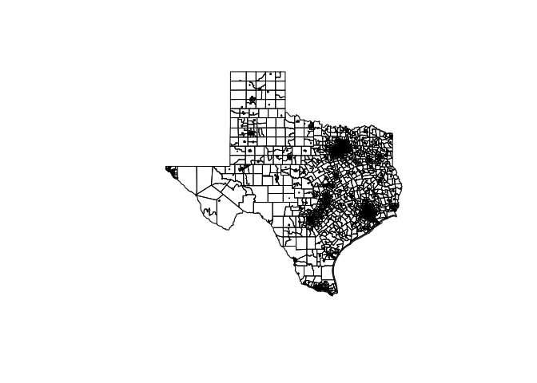<!-- -->

Data Exploration
----------------

We can explore/extract the individual slots in our spatial points data frame by using the <**@*>\* symbol instead of the **$** symbol. For example, let's look at the data-slot;

``` r
# Explore the SpatialPointsDataFrame
head(crime_spatial_df@data)
```

    ##                  time     date hour premise            offense  beat
    ## 1 2010-01-01 06:00:00 1/1/2010    0     18A             murder 15E30
    ## 2 2010-01-01 06:00:00 1/1/2010    0     13R            robbery 13D10
    ## 3 2010-01-01 06:00:00 1/1/2010    0     20R aggravated assault 16E20
    ## 4 2010-01-01 06:00:00 1/1/2010    0     20R aggravated assault  2A30
    ## 5 2010-01-01 06:00:00 1/1/2010    0     20A aggravated assault 14D20
    ## 6 2010-01-01 06:00:00 1/1/2010    0     20R           burglary 18F60
    ##       block    street type suffix number   month    day
    ## 1 9600-9699   marlive   ln      -      1 january friday
    ## 2 4700-4799 telephone   rd      -      1 january friday
    ## 3 5000-5099  wickview   ln      -      1 january friday
    ## 4 1000-1099   ashland   st      -      1 january friday
    ## 5 8300-8399    canyon <NA>      -      1 january friday
    ## 6 9300-9399     rowan   ln      -      1 january friday
    ##                   location           address       lon      lat
    ## 1    apartment parking lot   9650 marlive ln -95.43739 29.67790
    ## 2 road / street / sidewalk 4750 telephone rd -95.29888 29.69171
    ## 3        residence / house  5050 wickview ln -95.45586 29.59922
    ## 4        residence / house   1050 ashland st -95.40334 29.79024
    ## 5                apartment       8350 canyon -95.37791 29.67063
    ## 6        residence / house     9350 rowan ln -95.54830 29.70223

Other slots can also be extracted similary as follows.

``` r
head(crime_spatial_df@coords, 4)
```

    ##            lon      lat
    ## [1,] -95.43739 29.67790
    ## [2,] -95.29888 29.69171
    ## [3,] -95.45586 29.59922
    ## [4,] -95.40334 29.79024

``` r
crime_spatial_df@bbox
```

    ##           min       max
    ## lon -99.50555 -91.94627
    ## lat  27.50711  37.33690

``` r
crime_spatial_df@proj4string
```

    ## CRS arguments: +proj=longlat +ellps=WGS84

``` r
# Restrict the data to capetown only
downtown_crime <- subset(crime_df, 
                         -95.39681 <= lon & lon <= -95.34188 &
                          29.73631 <= lat & lat <= 29.78400)
```

Data Visualisation
------------------

R has several packages for visualizing spatial data. We shall look at tradition plotting systems in R that come with an R installation, commonly named "base-R" packages. An example is the `plot()` function for spatial data in the **sp** package. We shall also explore "external" packages for doing including ggplot2, ggmap, leaflet, tmap and plotly. The purpose of this report is conduct spatial analysis of the CDR sample data.

### Visualizing the Data Using Traditional Plot System

The \*\*sp\* package provides functions for plotting spatial data by adding layers incrementally. Let's start by plotting the shapefiles of Houston Texas.

``` r
plot(texas_shp, col = "grey", axes = TRUE)
```

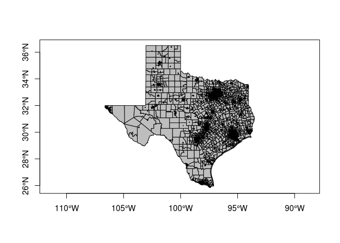<!-- -->

Then let's add crime data onto the map. Use the argument `add = TRUE` to add another layer onto the plot.

``` r
plot(texas_shp, col = "grey", axes = TRUE)
plot(crime_spatial_df, pch = 21, bg = "red", cex = .5, add = TRUE)
```

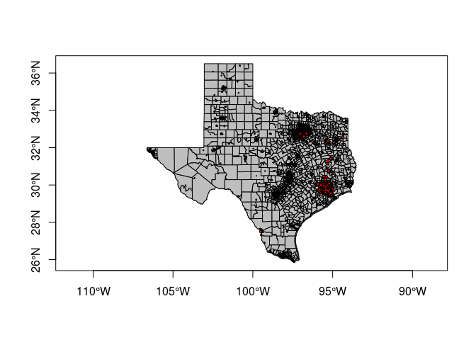<!-- -->

Then add a title and a legend.

``` r
plot(texas_shp, col = "grey", axes = TRUE)
plot(crime_spatial_df, pch = 21, bg = "red", cex = .5, add = TRUE)
title("Locations of Offensive Crimes in Houston, Texas")
legend("topleft", title = "Legend", legend = "Crime Locations", pch = 21, pt.bg = "red", bty = "n")
```

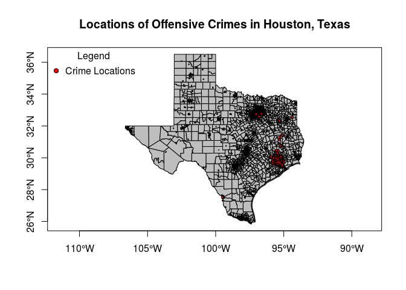<!-- -->

While the base functions for plotting spatial data can do the job, I prefer using external R libraries that provide more capabilities and produce beautiful maps like ggplot2, ggmap, leaflet.

### Visializing the Data Using External Libraries

#### ggplot2

ggplot2 works with data frames and not objects of class **Spatial**\*. So we have to convert them using the `fortify()` function in ggplot2.

``` r
crime_df <- data.frame(crime_spatial_df)
texas_shp_df <- fortify(texas_shp)
```

    ## Regions defined for each Polygons

Now we can leverage **gplot2's** powerful plotting capabilities.

``` r
p <- ggplot() + 
  geom_polygon(data = texas_shp_df, aes(x=long, y=lat, group = group)) + coord_equal() +
  geom_point(data = crime_df, aes(x = lon, y = lat, color = "red")) +
  labs(title = "Locations of Offensive Crimes in Houston, Texas") +
  xlab("Longitude") + 
  ylab("Latitude")

p
```

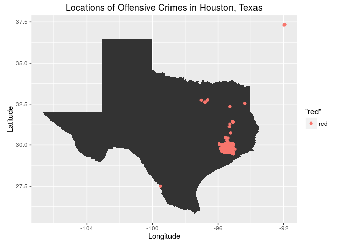<!-- -->

#### ggmap

Create the static background layer for the city of Houston, Texas

``` r
## Use "get_map" command to download the images and format them for plotting
map_dat <- get_map(location = "houston", source = "osm", zoom = 14)
```

    ## Map from URL : http://maps.googleapis.com/maps/api/staticmap?center=houston&zoom=14&size=640x640&scale=2&maptype=terrain&sensor=false

    ## Information from URL : http://maps.googleapis.com/maps/api/geocode/json?address=houston&sensor=false

Use "ggmap" command to make the plot

``` r
houstonMap <- ggmap(map_dat, extent = "device", legend = "topleft")
houstonMap
```

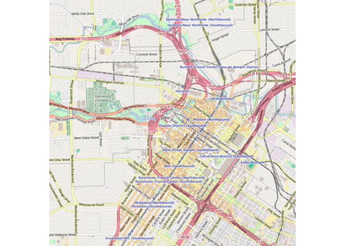<!-- -->

Geocode the entire data using longitute and latitute variables

``` r
houstonMap2 <- houstonMap + 
  geom_point(aes(x = lon, y = lat), data = downtown_crime, alpha = 0.5, color="darkred", size = 3)

houstonMap2
```

    ## Warning: Removed 42 rows containing missing values (geom_point).

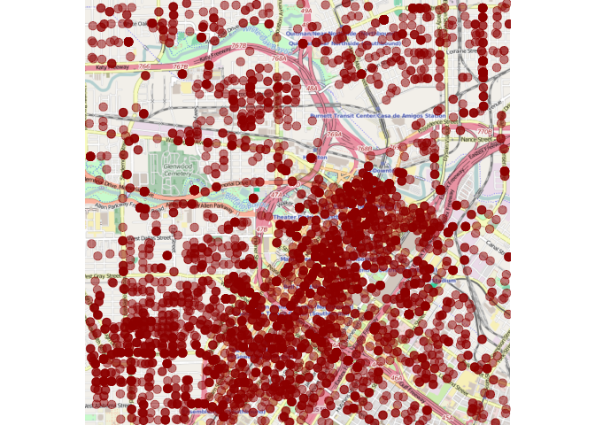<!-- -->

Plot the shapefiles

``` r
houstonMap3 <- houstonMap2 + 
  geom_polygon(aes(x = long, y = lat, group = group), data = texas_shp_df, colour = "black", 
               alpha = .4, size = .3)

houstonMap3
```

    ## Warning: Removed 42 rows containing missing values (geom_point).

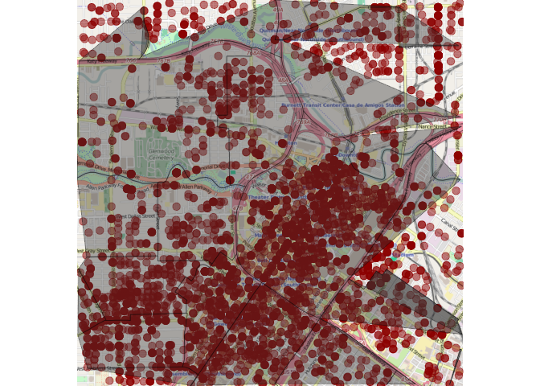<!-- -->

#### Leaflet

Leaflet for R is a package that provides functions to develop elegant and beautiful Leaflet maps. [Leaflet](http://leafletjs.com/) is the leading open-source JavaScript library for interactive maps.

Let's first start by creating a map of the the houston area and then adding layers (features). This can be done using the `leaflet()` command. The first layer that we should add are the "Tiles" using the `addTiles` command.

``` r
m <- leaflet() %>% setView(lng = -95.3698028, lat = 29.7604267, zoom = 12) %>% addTiles()
m
```

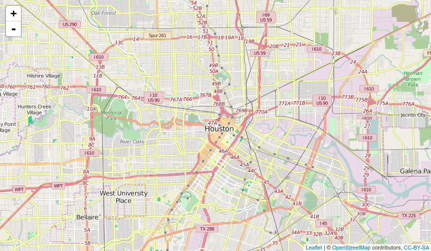

Then add the shapefile data onto the map. This is added as another layer, polygon, using the `addPolygon` command.

``` r
m1 <- m %>% addPolygons(data = texas_shp)
m1
```

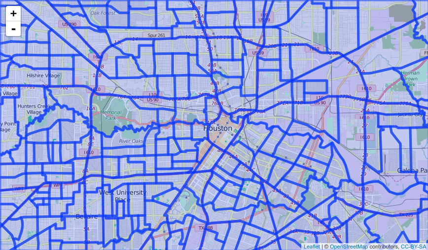

Finally add the crime data onto the map. This is added as another layer, points, using the `addMarkers` command.

``` r
m2 <- m1 %>% addCircles(data = crime_spatial_df)
m2
```

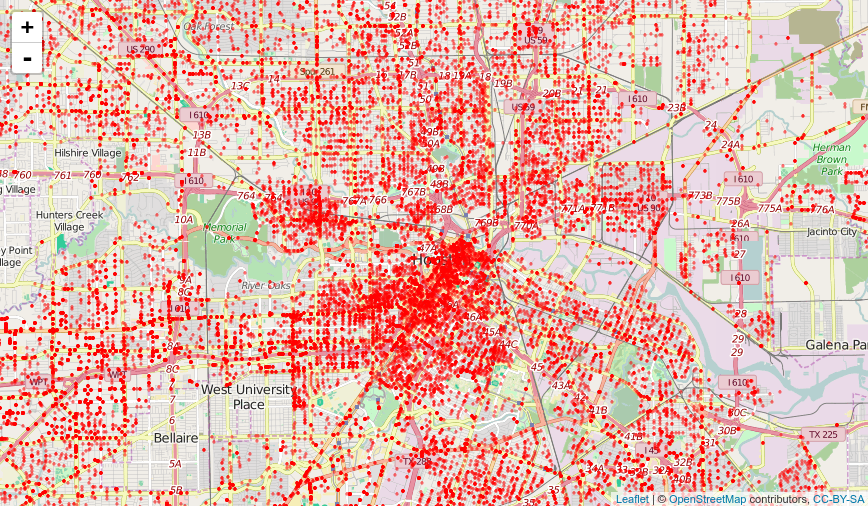

Geostatistical Analysis
-----------------------

In the next blog post, we shall see how to perform geostatistical analysis on spatial data.

References
----------

For further reading, refer to the following references.

1.  [Applied Spatial Data Analysis with R](http://www.asdar-book.org/). Roger S. Bivand, Edzer Pebesma and V. Gómez-Rubio. UseR! Series, Springer. 2nd ed. 2013, xviii+405 pp., Softcover. ISBN: 978-1-4614-7617-7
2.  [ggmap: Spatial Visualization with ggplot2](https://cran.r-project.org/web/packages/ggmap/ggmap.pdf)
3.  [Do more with dates and times in R with lubridate 1.3.0](https://cran.r-project.org/web/packages/lubridate/vignettes/lubridate.html)
4.  [Introduction to visualising spatial data in R](https://github.com/Robinlovelace/Creating-maps-in-R). Robin Lovelace (<R.Lovelace@leeds.ac.uk>), James Cheshire, Rachel Oldroyd and others V. 1.3, September 2015
5.  [Leaflet for R](http://rstudio.github.io/leaflet/basemaps.html)
6.  [gglot2 documentation](http://docs.ggplot2.org/current/index.html)
7.  [Introduction to dplyr](https://cran.rstudio.com/web/packages/dplyr/vignettes/introduction.html)
