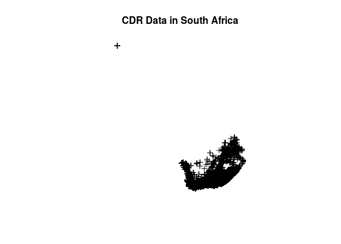
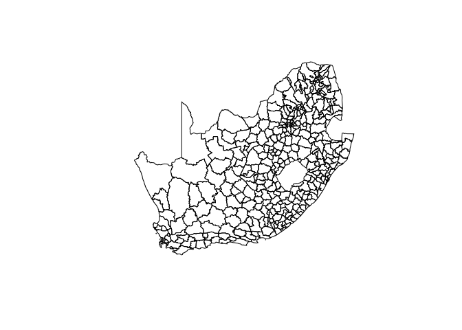
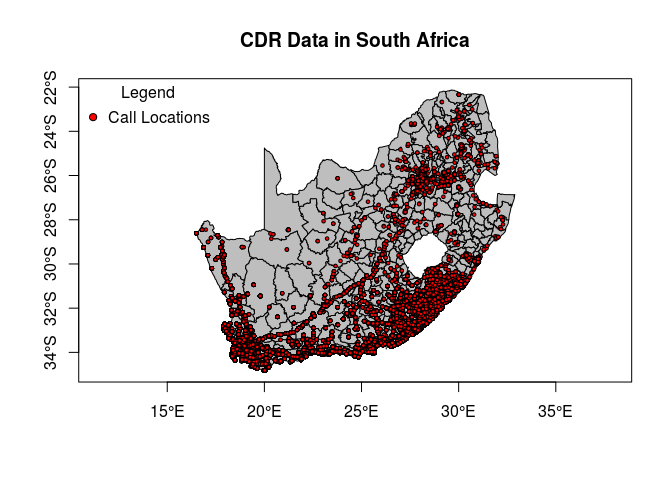
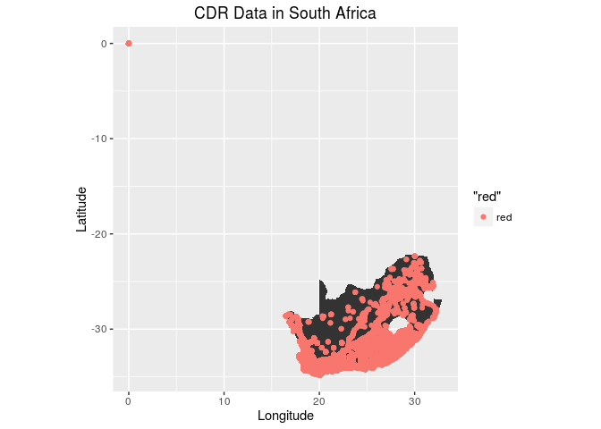

Applied Spatial Data Science with R
===================================

Introduction
------------

### Why use R for Spatial Analysis

Data Preparation
----------------

    ## These are the packages needed for data preparation
    suppressPackageStartupMessages(library(ggplot2))
    suppressPackageStartupMessages(library(dplyr))
    suppressPackageStartupMessages(library(tidyr))
    suppressPackageStartupMessages(library(lubridate))
    suppressPackageStartupMessages(library(readr))
    suppressPackageStartupMessages(library(magrittr))
    suppressPackageStartupMessages(library(sp))
    suppressPackageStartupMessages(library(rgdal))

    theme_set(theme_bw())

### Reading Spatial Data

The raw data is in text format and 12.6 MB in size.

    ##      date_time       hashed_id  latitude longitude
    ## 1 2.015123e+16 660570183834033 -33.91114  18.61418
    ## 2 2.015123e+16 660574684112000 -34.00284  18.54191
    ## 3 2.015123e+16 660573944817324 -33.98153  18.49034
    ## 4 2.015123e+16 660578844436614 -33.82674  18.53819
    ## 5 2.015123e+16 660579543978203 -33.88652  18.50051
    ## 6 2.015123e+16 660570589985809 -33.45624  22.37440

    ##    date_time                   hashed_id         latitude     
    ##  Min.   :2.015e+16   660577853889743:   152   Min.   :-34.83  
    ##  1st Qu.:2.015e+16   660573844463583:   128   1st Qu.:-34.02  
    ##  Median :2.015e+16   660574513913068:   128   Median :-33.92  
    ##  Mean   :2.015e+16   660577853867870:   113   Mean   :-33.37  
    ##  3rd Qu.:2.015e+16   660574646127052:    83   3rd Qu.:-33.41  
    ##  Max.   :2.015e+16   660577184566109:    79   Max.   :  0.00  
    ##                      (Other)        :217452                   
    ##    longitude    
    ##  Min.   : 0.00  
    ##  1st Qu.:18.56  
    ##  Median :19.02  
    ##  Mean   :21.52  
    ##  3rd Qu.:25.02  
    ##  Max.   :32.29  
    ## 

    ## 'data.frame':    218135 obs. of  4 variables:
    ##  $ date_time: num  2.02e+16 2.02e+16 2.02e+16 2.02e+16 2.02e+16 ...
    ##  $ hashed_id: Factor w/ 93010 levels "660570183815963",..: 16 39325 27003 79771 89002 1925 53311 45258 73256 61511 ...
    ##  $ latitude : num  -33.9 -34 -34 -33.8 -33.9 ...
    ##  $ longitude: num  18.6 18.5 18.5 18.5 18.5 ...

The dataset is made up of 218,136 observations with four columns
including date-time, a hased ID, longitude and latitude.

    ## Find out how many rows have latitude and longitude equal to zero respectively
    (filter(cdr_df, latitude == 0)) %>% count()

    ## Source: local data frame [1 x 1]
    ## 
    ##       n
    ##   (int)
    ## 1   499

    (filter(cdr_df, longitude == 0)) %>% count()

    ## Source: local data frame [1 x 1]
    ## 
    ##       n
    ##   (int)
    ## 1   499

    cdr_df2 <- filter(cdr_df, latitude != 0 & longitude != 0)
    summary(cdr_df2)

    ##    date_time                   hashed_id         latitude     
    ##  Min.   :2.015e+16   660577853889743:   152   Min.   :-34.83  
    ##  1st Qu.:2.015e+16   660573844463583:   128   1st Qu.:-34.02  
    ##  Median :2.015e+16   660574513913068:   128   Median :-33.92  
    ##  Mean   :2.015e+16   660577853867870:   113   Mean   :-33.45  
    ##  3rd Qu.:2.015e+16   660574646127052:    83   3rd Qu.:-33.42  
    ##  Max.   :2.015e+16   660577184566109:    79   Max.   :-22.34  
    ##                      (Other)        :216953                   
    ##    longitude    
    ##  Min.   :16.50  
    ##  1st Qu.:18.56  
    ##  Median :19.03  
    ##  Mean   :21.57  
    ##  3rd Qu.:25.05  
    ##  Max.   :32.29  
    ## 

There are 499 records with latitude and longitude equal to zero. We
shall remove these assuming that they are errors in the data. when these
coordinate errors are removed, we remain with 217,636 records.

Create new separate columns for the Date and Time. Format the date and
time variables into data and time data types respectively. South Africa
Time zone is UTC+02:00.

    ## Warning: 34 failed to parse.

    ##      date_time       hashed_id  latitude longitude         date_time2
    ## 1 2.015123e+16 660570183834033 -33.91114  18.61418 20151228061501.184
    ## 2 2.015123e+16 660574684112000 -34.00284  18.54191 20151228061501.184
    ## 3 2.015123e+16 660573944817324 -33.98153  18.49034 20151228062135.784
    ## 4 2.015123e+16 660578844436614 -33.82674  18.53819 20151228062135.784
    ## 5 2.015123e+16 660579543978203 -33.88652  18.50051 20151228062135.784
    ## 6 2.015123e+16 660570589985809 -33.45624  22.37440 20151228061458.272
    ##            date_time3
    ## 1 2015-12-28 06:15:01
    ## 2 2015-12-28 06:15:01
    ## 3 2015-12-28 06:21:35
    ## 4 2015-12-28 06:21:35
    ## 5 2015-12-28 06:21:35
    ## 6 2015-12-28 06:14:58

    ## 'data.frame':    218135 obs. of  6 variables:
    ##  $ date_time : num  2.02e+16 2.02e+16 2.02e+16 2.02e+16 2.02e+16 ...
    ##  $ hashed_id : Factor w/ 93010 levels "660570183815963",..: 16 39325 27003 79771 89002 1925 53311 45258 73256 61511 ...
    ##  $ latitude  : num  -33.9 -34 -34 -33.8 -33.9 ...
    ##  $ longitude : num  18.6 18.5 18.5 18.5 18.5 ...
    ##  $ date_time2: chr  "20151228061501.184" "20151228061501.184" "20151228062135.784" "20151228062135.784" ...
    ##  $ date_time3: POSIXct, format: "2015-12-28 06:15:01" "2015-12-28 06:15:01" ...

Write out the processed data into a csv and RDS file.

### Spatial Points Dataframe

Convert the cdr\_df local dataframe into SpatialPointsDataFrame for
spatial analysis.

    ## Convert to SpatialPointsDataFrame with longitude and latitude so as to use spatial packages
    ## The CRS is a Geographic CRS called WGS84
    coords <- SpatialPoints(cdr_df3[, c("longitude", "latitude")])
    cdr_spatial_df <- SpatialPointsDataFrame(coords, cdr_df3)
    proj4string(cdr_spatial_df) <- CRS("+proj=longlat +ellps=WGS84")

    # Or using the "coordinates" method
    cdr_spatial_df1 <- cdr_df3
    coordinates(cdr_spatial_df1) <- c("longitude", "latitude")
    proj4string(cdr_spatial_df1) <- CRS("+proj=longlat +ellps=WGS84")

    # Explore the SpatialPointsDataFrame
    head(cdr_spatial_df@coords, 4)

    ##      longitude  latitude
    ## [1,]  18.61418 -33.91114
    ## [2,]  18.54191 -34.00284
    ## [3,]  18.49034 -33.98153
    ## [4,]  18.53819 -33.82674

    head(cdr_spatial_df@bbox)

    ##                 min      max
    ## longitude   0.00000 32.28528
    ## latitude  -34.82607  0.00000

    ## Create a file of the final processed spatial points data frame that will be used for analysis
    saveRDS(cdr_spatial_df, "cdr_spatial_data.rds")

    ## Also create a shapefile of this data
    writeOGR(cdr_spatial_df, dsn = "shapefiles", layer = "cdr-shapefile", driver = "ESRI Shapefile")

\#\# Data Exploration
=====================

The purpose of this report is to display the descriptive and graphical statistics of this cdr sample data.
==========================================================================================================

`{r DescriptiveStats, echo = FALSE} # ## Load the processed SpatialPointsDataFrame # cdr_spatial_df <- readRDS("cdr_spatial_data.rds") #  # ## Create a SpatialPolygonsDataFrame by reading in shapefile data # ## Use plot method to plot it # shapefile_2 <- readOGR(dsn = "ZAF_adm", layer = "ZAF_adm2") #`
==============================================================================================================================================================================================================================================================================================================

\#\#\# Map Overlay or Spatial Join
==================================

`{r spatial_join, echo = TRUE} # ## Perform a spatial join to join the shapefile data to the point data # over() #  #  #`
=========================================================================================================================

\#\#\# Question 1: What is the distribution of call made by callers
===================================================================

`{r, echo = FALSE} # callers <- group_by(cdr_df, hashed_id)  # call_dist <- summarise(callers, calls_made = n())  # arrange(call_dist, desc(calls_made)) #  #`
==============================================================================================================================================================

`{r, echo = FALSE } # grouped_by_time <- group_by(cdr_df, date_time3) # calls_per_day <- summarise(grouped_by_time, count = n()) # head(arrange(calls_per_day, desc(count))) # tail <- tail(arrange(calls_per_day, desc(count)), n = 30) #`
===========================================================================================================================================================================================================================================

\#\#\# Question 3: What is the duration of the data
===================================================

`{r , echo = FALSE} # time_df <- transmute(cdr_df,  #                      start_time = min(as.Date(date_time3)), #                      end_time = max (as.Date(date_time3))) #  # ## Then get the difference between the start time and end time # diff <- time_df$end_time - time_df$end_time #  #  # ## Ouestion 2: What is the distributions of calls by day #  #  # ## Question 4: What the distribution of calls by time interval. # start <- as.Date("2010/01/01") # end <- as.Date("2010/12/31") # set.seed(1) # datewant <- seq(start, end, by = "days")[sample(15)] # tmpTimes <- data.frame(EntryTime = datewant,  #                        ExitTime = datewant + sample(100, 15)) # ## reorder on EntryTime so in random order # tmpTimes <- tmpTimes[sample(NROW(tmpTimes)), ] # head(tmpTimes) #  #  max(tmpTimes$EntryTime) - min(tmpTimes$EntryTime) #`
========================================================================================================================================================================================================================================================================================================================================================================================================================================================================================================================================================================================================================================================================================================================================================================================================================================================================

Data Visualisation
------------------

The purpose of this report is conduct spatial analysis of the CDR sample
data.

    ## Install packages required for spatial analysis
    suppressPackageStartupMessages(library(ggplot2))
    suppressPackageStartupMessages(library(dplyr))
    suppressPackageStartupMessages(library(tidyr))
    suppressPackageStartupMessages(library(lubridate))
    suppressPackageStartupMessages(library(readr))
    suppressPackageStartupMessages(library(magrittr))
    suppressPackageStartupMessages(library(leaflet))
    suppressPackageStartupMessages(library(ggmap))
    suppressPackageStartupMessages(library(tmap))
    suppressPackageStartupMessages(library(maps))
    suppressPackageStartupMessages(library(RColorBrewer))
    suppressPackageStartupMessages(library(classInt))

Visualizing the Data Using Traditional Plot System
==================================================

    cdr_spatial_df <- readRDS("cdr_spatial_data.rds")
    plot(cdr_spatial_df, add = FALSE)
    title("CDR Data in South Africa")

<!-- -->

    ## Create a SpatialPolygonsDataFrame by reading in shapefile data
    ## Use plot method to plot it
    shapefile_2 <- readOGR(dsn = "ZAF_adm", layer = "ZAF_adm2")

    ## OGR data source with driver: ESRI Shapefile 
    ## Source: "ZAF_adm", layer: "ZAF_adm2"
    ## with 354 features
    ## It has 18 fields

    plot(shapefile_2)

<!-- -->

    ## Combine both plots INCREMENTALLY
    plot(shapefile_2, col = "grey", axes = TRUE)
    plot(cdr_spatial_df, pch = 21, bg = "red", cex = .5, add = TRUE)
    title("CDR Data in South Africa")
    legend("topleft", title = "Legend", legend = "Call Locations", pch = 21, 
           pt.bg = "red", bty = "n")

<!-- -->

Visualizing the Data Using spplot Using Lattice package
=======================================================

    ## spplot provides plotting of spatial data with attributes

Visializing the Data Using External Libraries
=============================================

ggplot2
-------

    cdr_ggplot_df <- as.data.frame(cdr_spatial_df)
    shapefile_df2 <- fortify(shapefile_2)

    ## Regions defined for each Polygons

    p <- ggplot() + 
      geom_polygon(data = shapefile_df2, aes(x=long, y=lat, group = group)) + coord_equal() +
      geom_point(data = cdr_ggplot_df, aes(longitude,latitude, color = "red")) +
      labs(title = "CDR Data in South Africa") +
      xlab("Longitude") + 
      ylab("Latitude")

    p

<!-- -->

ggmap
-----

    ## Create the background layer for the city of Cape Town, South Africa. Two Steps using ggmap

    ## Step 1: Use "get_map" command to download the images and format them for plotting
    southafricaMap <- get_map(location = "Bloemfontein", source = "osm", zoom = 5)

    ## Map from URL : http://maps.googleapis.com/maps/api/staticmap?center=Bloemfontein&zoom=5&size=640x640&scale=2&maptype=terrain&sensor=false

    ## Information from URL : http://maps.googleapis.com/maps/api/geocode/json?address=Bloemfontein&sensor=false

    capetownMap <- get_map(location = "bellville southafrica", source = "osm", zoom = 10)

    ## Map from URL : http://maps.googleapis.com/maps/api/staticmap?center=bellville+southafrica&zoom=10&size=640x640&scale=2&maptype=terrain&sensor=false

    ## Information from URL : http://maps.googleapis.com/maps/api/geocode/json?address=bellville%20southafrica&sensor=false

    ## Step 2: use "ggmap" command to making the plot
    saMap <- ggmap(southafricaMap, extent = "device", legend = "topleft")
    ctMap <- ggmap(capetownMap, extent = "device", legend = "topleft")

    ## Load the cdr data for mapping purposes
    cdr_data <- cdr_df3
    cdr_data <- subset(cdr_data, longitude > 0 & latitude < 0)

    # Restrict the data to capetown only
    capetown_cdr <- subset(cdr_data, 
                             18.24325 <= longitude & longitude <= 19.43949 & 
                             -34.48969 <= latitude & latitude <= -33.33964)

    ## Geocode the entire cdr data using longitute and latitute variables
    saMap2 <- saMap + geom_point(
      aes(x = longitude, y = latitude), data = cdr_data, 
      alpha = 0.5, color="darkred", size = 3
    )

    ## Geocode only the cape town cdr data using longitute and latitute variables
    ctMap <- ctMap + geom_point(
      aes(x = longitude, y = latitude), data = capetown_cdr, 
      alpha = 0.5, color="darkred", size = 3
    )

    ## Install required packages
    suppressPackageStartupMessages(library(sp))
    suppressPackageStartupMessages(library(maptools))

    # Read shapefile data into R using maptools package
    shapefile0 <- readShapeSpatial("ZAF_adm/ZAF_adm0.shp", proj4string = CRS("+proj=longlat +datum=WGS84"))
    shapefile1 <- readShapeSpatial("ZAF_adm/ZAF_adm1.shp", proj4string = CRS("+proj=longlat +datum=WGS84"))
    shapefile2 <- readShapeSpatial("ZAF_adm/ZAF_adm2.shp", proj4string = CRS("+proj=longlat +datum=WGS84"))

    ## Convert the shapefiles to a data.frame for use with ggplot2/ggmap
    shapefile_df0 <- fortify(shapefile0)

    ## Regions defined for each Polygons

    shapefile_df1 <- fortify(shapefile1)

    ## Regions defined for each Polygons

    shapefile_df2 <- fortify(shapefile2)

    ## Regions defined for each Polygons

    ## Plot the shapefiles
    saMap3 <- saMap2 + geom_polygon(aes(x = long, y = lat, group = group), data = shapefile_df2, colour = "black", alpha = .4, size = .3)

    saMap3

<!-- -->

Leaflet
-------

tmap
----

Geostatistical Analysis
-----------------------
